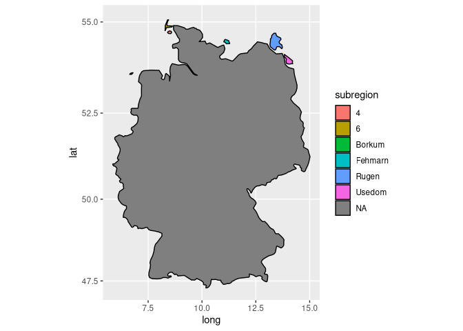
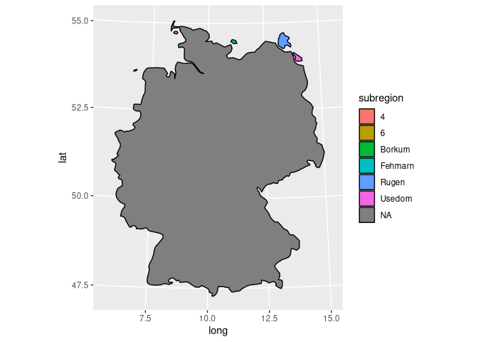
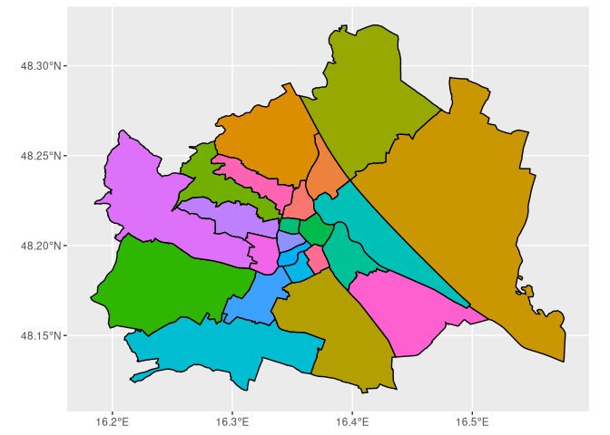
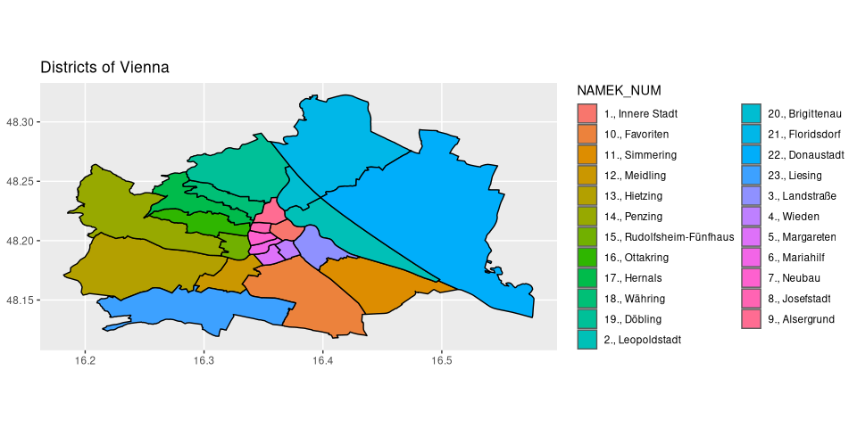
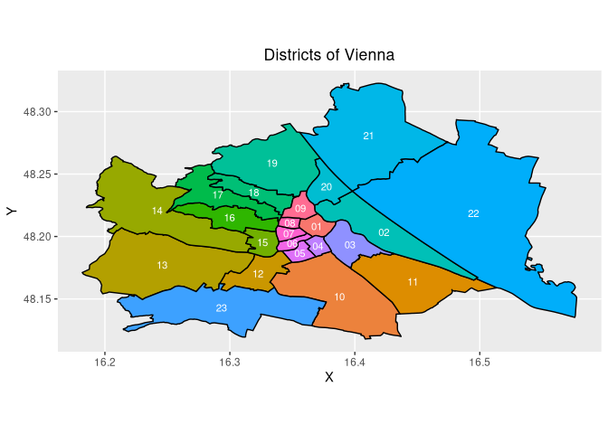

Maps or Geo-Spatial Data Visualization
================

<https://www.youtube.com/watch?v=AbrReroOWS8>

``` r
if (!require("pacman")) install.packages("pacman")
```

    ## Lade nötiges Paket: pacman

``` r
library("pacman")


knitr::opts_chunk$set(
  fig.path = "figures/tolle-karte/"
)
```

## Map Data

The `maps` package provides the coordinates of the borders for each
country in the world.

``` r
p_load(ggplot2, maps)
germany <- map_data("world", region = "Germany")

p_load(knitr)
kable(germany[1:5,])
```

|     long |      lat | group | order | region  | subregion |
|---------:|---------:|------:|------:|:--------|:----------|
| 14.21367 | 53.87075 |     1 |     1 | Germany | Usedom    |
| 14.17217 | 53.87437 |     1 |     2 | Germany | Usedom    |
| 14.04834 | 53.86309 |     1 |     3 | Germany | Usedom    |
| 13.92578 | 53.87905 |     1 |     4 | Germany | Usedom    |
| 13.90215 | 53.93896 |     1 |     5 | Germany | Usedom    |

`coord_map` of the `mapproj` package, allows geographical projection of
the data.

``` r
p_load(mapproj)
p_load(dplyr)

germany %>% ggplot(aes(long, lat, group = group, fill = subregion)) +
  geom_polygon(color = "black") +
  coord_map()
```

<!-- -->

``` r
germany %>% ggplot(aes(long, lat, group = group, fill = subregion)) +
  geom_polygon(color = "black") +
  coord_map("albers",  lat0 = 45.5, lat1 = 29.5)
```

<!-- -->

## Spatial Data with sf

Some countries provide spatial data in certain data formats such as KML
or KMZ (which is an compressed version of KML).

Austria provides the districts borders of Vienna at their
[data.gv.at](https://www.data.gv.at/) page:

-   <https://www.data.gv.at/katalog/dataset/2ee6b8bf-6292-413c-bb8b-bd22dbb2ad4b>

The `.kml` file can be retrieved under following url:

``` r
districts_kml_url <- "https://data.wien.gv.at/daten/geo?version=1.3.0&service=WMS&request=GetMap&crs=EPSG:4326&bbox=48.10,16.16,48.34,16.59&width=1&height=1&layers=ogdwien:BEZIRKSGRENZEOGD&styles=&format=application/vnd.google-earth.kml+xml"

p_load(devtools)
if (!require("sf")) devtools::install_github("r-spatial/sf")
```

    ## Lade nötiges Paket: sf

    ## Linking to GEOS 3.9.1, GDAL 3.4.0, PROJ 8.2.0; sf_use_s2() is TRUE

``` r
# Both the URL and the local path to the .kml-file work
vienna_districts <- read_sf(districts_kml_url)

vienna_districts$geometry
```

    ## Geometry set for 23 features 
    ## Geometry type: GEOMETRYCOLLECTION
    ## Dimension:     XY
    ## Bounding box:  xmin: 16.18183 ymin: 48.1179 xmax: 16.57751 ymax: 48.32267
    ## Geodetic CRS:  WGS 84
    ## First 5 geometries:

    ## GEOMETRYCOLLECTION (POINT (16.32607 48.19547), ...

    ## GEOMETRYCOLLECTION (POINT (16.34696 48.20252), ...

    ## GEOMETRYCOLLECTION (POINT (16.39608 48.19376), ...

    ## GEOMETRYCOLLECTION (POINT (16.34782 48.21103), ...

    ## GEOMETRYCOLLECTION (POINT (16.3694 48.20836), P...

``` r
vienna_districts$geometry[1]
```

    ## Geometry set for 1 feature 
    ## Geometry type: GEOMETRYCOLLECTION
    ## Dimension:     XY
    ## Bounding box:  xmin: 16.3107 ymin: 48.18372 xmax: 16.3394 ymax: 48.20723
    ## Geodetic CRS:  WGS 84

    ## GEOMETRYCOLLECTION (POINT (16.32607 48.19547), ...

``` r
vienna_districts$Description
```

    ##  [1] "<h4>BEZIRKSGRENZEOGD</h4> <ul class=\"textattributes\"> <li><strong><span class=\"atr-name\">NAMEK</span>:</strong> <span class=\"atr-value\">Rudolfsheim-Fünfhaus</span></li> <li><strong><span class=\"atr-name\">BEZNR</span>:</strong> <span class=\"atr-value\">15</span></li> <li><strong><span class=\"atr-name\">BEZ_RZ</span>:</strong> <span class=\"atr-value\">XV</span></li> <li><strong><span class=\"atr-name\">NAMEK_NUM</span>:</strong> <span class=\"atr-value\">15., Rudolfsheim-Fünfhaus</span></li> <li><strong><span class=\"atr-name\">NAMEK_RZ</span>:</strong> <span class=\"atr-value\">XV. Rudolfsheim-Fünfhaus</span></li> <li><strong><span class=\"atr-name\">NAMEG</span>:</strong> <span class=\"atr-value\">RUDOLFSHEIM-FÜNFHAUS</span></li> <li><strong><span class=\"atr-name\">LABEL</span>:</strong> <span class=\"atr-value\">XV.</span></li> <li><strong><span class=\"atr-name\">BEZ</span>:</strong> <span class=\"atr-value\">15</span></li> <li><strong><span class=\"atr-name\">DISTRICT_CODE</span>:</strong> <span class=\"atr-value\">1150</span></li> <li><strong><span class=\"atr-name\">STATAUSTRIA_BEZ_CODE</span>:</strong> <span class=\"atr-value\">915</span></li> <li><strong><span class=\"atr-name\">STATAUSTRIA_GEM_CODE</span>:</strong> <span class=\"atr-value\">91501</span></li> <li><strong><span class=\"atr-name\">FLAECHE</span>:</strong> <span class=\"atr-value\">3918463.2875</span></li> <li><strong><span class=\"atr-name\">UMFANG</span>:</strong> <span class=\"atr-value\">9713.17</span></li> <li><strong><span class=\"atr-name\">AKT_TIMESTAMP</span>:</strong> <span class=\"atr-value\">16.02.22 00:00</span></li> <li><strong><span class=\"atr-name\">SE_SDO_ROWID</span>:</strong> <span class=\"atr-value\">11207</span></li> </ul>"                                                                                    
    ##  [2] "<h4>BEZIRKSGRENZEOGD</h4> <ul class=\"textattributes\"> <li><strong><span class=\"atr-name\">NAMEK</span>:</strong> <span class=\"atr-value\">Neubau</span></li> <li><strong><span class=\"atr-name\">BEZNR</span>:</strong> <span class=\"atr-value\">7</span></li> <li><strong><span class=\"atr-name\">BEZ_RZ</span>:</strong> <span class=\"atr-value\">VII</span></li> <li><strong><span class=\"atr-name\">NAMEK_NUM</span>:</strong> <span class=\"atr-value\">7., Neubau</span></li> <li><strong><span class=\"atr-name\">NAMEK_RZ</span>:</strong> <span class=\"atr-value\">VII. Neubau</span></li> <li><strong><span class=\"atr-name\">NAMEG</span>:</strong> <span class=\"atr-value\">NEUBAU</span></li> <li><strong><span class=\"atr-name\">LABEL</span>:</strong> <span class=\"atr-value\">VII.</span></li> <li><strong><span class=\"atr-name\">BEZ</span>:</strong> <span class=\"atr-value\">07</span></li> <li><strong><span class=\"atr-name\">DISTRICT_CODE</span>:</strong> <span class=\"atr-value\">1070</span></li> <li><strong><span class=\"atr-name\">STATAUSTRIA_BEZ_CODE</span>:</strong> <span class=\"atr-value\">907</span></li> <li><strong><span class=\"atr-name\">STATAUSTRIA_GEM_CODE</span>:</strong> <span class=\"atr-value\">90701</span></li> <li><strong><span class=\"atr-name\">FLAECHE</span>:</strong> <span class=\"atr-value\">1608248.1317</span></li> <li><strong><span class=\"atr-name\">UMFANG</span>:</strong> <span class=\"atr-value\">5312.54</span></li> <li><strong><span class=\"atr-name\">AKT_TIMESTAMP</span>:</strong> <span class=\"atr-value\">16.02.22 00:00</span></li> <li><strong><span class=\"atr-name\">SE_SDO_ROWID</span>:</strong> <span class=\"atr-value\">11208</span></li> </ul>"                                                                                                                                           
    ##  [3] "<h4>BEZIRKSGRENZEOGD</h4> <ul class=\"textattributes\"> <li><strong><span class=\"atr-name\">NAMEK</span>:</strong> <span class=\"atr-value\">Landstraße</span></li> <li><strong><span class=\"atr-name\">BEZNR</span>:</strong> <span class=\"atr-value\">3</span></li> <li><strong><span class=\"atr-name\">BEZ_RZ</span>:</strong> <span class=\"atr-value\">III</span></li> <li><strong><span class=\"atr-name\">NAMEK_NUM</span>:</strong> <span class=\"atr-value\">3., Landstraße</span></li> <li><strong><span class=\"atr-name\">NAMEK_RZ</span>:</strong> <span class=\"atr-value\">III. Landstraße</span></li> <li><strong><span class=\"atr-name\">NAMEG</span>:</strong> <span class=\"atr-value\">LANDSTRASSE</span></li> <li><strong><span class=\"atr-name\">LABEL</span>:</strong> <span class=\"atr-value\">III.</span></li> <li><strong><span class=\"atr-name\">BEZ</span>:</strong> <span class=\"atr-value\">03</span></li> <li><strong><span class=\"atr-name\">DISTRICT_CODE</span>:</strong> <span class=\"atr-value\">1030</span></li> <li><strong><span class=\"atr-name\">STATAUSTRIA_BEZ_CODE</span>:</strong> <span class=\"atr-value\">903</span></li> <li><strong><span class=\"atr-name\">STATAUSTRIA_GEM_CODE</span>:</strong> <span class=\"atr-value\">90301</span></li> <li><strong><span class=\"atr-name\">FLAECHE</span>:</strong> <span class=\"atr-value\">7403076.6748</span></li> <li><strong><span class=\"atr-name\">UMFANG</span>:</strong> <span class=\"atr-value\">13962.28</span></li> <li><strong><span class=\"atr-name\">AKT_TIMESTAMP</span>:</strong> <span class=\"atr-value\">16.02.22 00:00</span></li> <li><strong><span class=\"atr-name\">SE_SDO_ROWID</span>:</strong> <span class=\"atr-value\">11209</span></li> <li><strong><span class=\"atr-name\">SE_ANNO_CAD_DATA</span>:</strong> <span class=\"atr-value\">[B@645a1f80</span></li> </ul>"
    ##  [4] "<h4>BEZIRKSGRENZEOGD</h4> <ul class=\"textattributes\"> <li><strong><span class=\"atr-name\">NAMEK</span>:</strong> <span class=\"atr-value\">Josefstadt</span></li> <li><strong><span class=\"atr-name\">BEZNR</span>:</strong> <span class=\"atr-value\">8</span></li> <li><strong><span class=\"atr-name\">BEZ_RZ</span>:</strong> <span class=\"atr-value\">VIII</span></li> <li><strong><span class=\"atr-name\">NAMEK_NUM</span>:</strong> <span class=\"atr-value\">8., Josefstadt</span></li> <li><strong><span class=\"atr-name\">NAMEK_RZ</span>:</strong> <span class=\"atr-value\">VIII. Josefstadt</span></li> <li><strong><span class=\"atr-name\">NAMEG</span>:</strong> <span class=\"atr-value\">JOSEFSTADT</span></li> <li><strong><span class=\"atr-name\">LABEL</span>:</strong> <span class=\"atr-value\">VIII.</span></li> <li><strong><span class=\"atr-name\">BEZ</span>:</strong> <span class=\"atr-value\">08</span></li> <li><strong><span class=\"atr-name\">DISTRICT_CODE</span>:</strong> <span class=\"atr-value\">1080</span></li> <li><strong><span class=\"atr-name\">STATAUSTRIA_BEZ_CODE</span>:</strong> <span class=\"atr-value\">908</span></li> <li><strong><span class=\"atr-name\">STATAUSTRIA_GEM_CODE</span>:</strong> <span class=\"atr-value\">90801</span></li> <li><strong><span class=\"atr-name\">FLAECHE</span>:</strong> <span class=\"atr-value\">1089945.694</span></li> <li><strong><span class=\"atr-name\">UMFANG</span>:</strong> <span class=\"atr-value\">4170.3</span></li> <li><strong><span class=\"atr-name\">AKT_TIMESTAMP</span>:</strong> <span class=\"atr-value\">16.02.22 00:00</span></li> <li><strong><span class=\"atr-name\">SE_SDO_ROWID</span>:</strong> <span class=\"atr-value\">11210</span></li> </ul>"                                                                                                                          
    ##  [5] "<h4>BEZIRKSGRENZEOGD</h4> <ul class=\"textattributes\"> <li><strong><span class=\"atr-name\">NAMEK</span>:</strong> <span class=\"atr-value\">Innere Stadt</span></li> <li><strong><span class=\"atr-name\">BEZNR</span>:</strong> <span class=\"atr-value\">1</span></li> <li><strong><span class=\"atr-name\">BEZ_RZ</span>:</strong> <span class=\"atr-value\">I</span></li> <li><strong><span class=\"atr-name\">NAMEK_NUM</span>:</strong> <span class=\"atr-value\">1., Innere Stadt</span></li> <li><strong><span class=\"atr-name\">NAMEK_RZ</span>:</strong> <span class=\"atr-value\">I. Innere Stadt</span></li> <li><strong><span class=\"atr-name\">NAMEG</span>:</strong> <span class=\"atr-value\">INNERE STADT</span></li> <li><strong><span class=\"atr-name\">LABEL</span>:</strong> <span class=\"atr-value\">I.</span></li> <li><strong><span class=\"atr-name\">BEZ</span>:</strong> <span class=\"atr-value\">01</span></li> <li><strong><span class=\"atr-name\">DISTRICT_CODE</span>:</strong> <span class=\"atr-value\">1010</span></li> <li><strong><span class=\"atr-name\">STATAUSTRIA_BEZ_CODE</span>:</strong> <span class=\"atr-value\">901</span></li> <li><strong><span class=\"atr-name\">STATAUSTRIA_GEM_CODE</span>:</strong> <span class=\"atr-value\">90101</span></li> <li><strong><span class=\"atr-name\">FLAECHE</span>:</strong> <span class=\"atr-value\">2868773.8207</span></li> <li><strong><span class=\"atr-name\">UMFANG</span>:</strong> <span class=\"atr-value\">6972.75</span></li> <li><strong><span class=\"atr-name\">AKT_TIMESTAMP</span>:</strong> <span class=\"atr-value\">16.02.22 00:00</span></li> <li><strong><span class=\"atr-name\">SE_SDO_ROWID</span>:</strong> <span class=\"atr-value\">11211</span></li> </ul>"                                                                                                                         
    ##  [6] "<h4>BEZIRKSGRENZEOGD</h4> <ul class=\"textattributes\"> <li><strong><span class=\"atr-name\">NAMEK</span>:</strong> <span class=\"atr-value\">Ottakring</span></li> <li><strong><span class=\"atr-name\">BEZNR</span>:</strong> <span class=\"atr-value\">16</span></li> <li><strong><span class=\"atr-name\">BEZ_RZ</span>:</strong> <span class=\"atr-value\">XVI</span></li> <li><strong><span class=\"atr-name\">NAMEK_NUM</span>:</strong> <span class=\"atr-value\">16., Ottakring</span></li> <li><strong><span class=\"atr-name\">NAMEK_RZ</span>:</strong> <span class=\"atr-value\">XVI. Ottakring</span></li> <li><strong><span class=\"atr-name\">NAMEG</span>:</strong> <span class=\"atr-value\">OTTAKRING</span></li> <li><strong><span class=\"atr-name\">LABEL</span>:</strong> <span class=\"atr-value\">XVI.</span></li> <li><strong><span class=\"atr-name\">BEZ</span>:</strong> <span class=\"atr-value\">16</span></li> <li><strong><span class=\"atr-name\">DISTRICT_CODE</span>:</strong> <span class=\"atr-value\">1160</span></li> <li><strong><span class=\"atr-name\">STATAUSTRIA_BEZ_CODE</span>:</strong> <span class=\"atr-value\">916</span></li> <li><strong><span class=\"atr-name\">STATAUSTRIA_GEM_CODE</span>:</strong> <span class=\"atr-value\">91601</span></li> <li><strong><span class=\"atr-name\">FLAECHE</span>:</strong> <span class=\"atr-value\">8673048.1524</span></li> <li><strong><span class=\"atr-name\">UMFANG</span>:</strong> <span class=\"atr-value\">18371.08</span></li> <li><strong><span class=\"atr-name\">AKT_TIMESTAMP</span>:</strong> <span class=\"atr-value\">16.02.22 00:00</span></li> <li><strong><span class=\"atr-name\">SE_SDO_ROWID</span>:</strong> <span class=\"atr-value\">11212</span></li> </ul>"                                                                                                                            
    ##  [7] "<h4>BEZIRKSGRENZEOGD</h4> <ul class=\"textattributes\"> <li><strong><span class=\"atr-name\">NAMEK</span>:</strong> <span class=\"atr-value\">Alsergrund</span></li> <li><strong><span class=\"atr-name\">BEZNR</span>:</strong> <span class=\"atr-value\">9</span></li> <li><strong><span class=\"atr-name\">BEZ_RZ</span>:</strong> <span class=\"atr-value\">IX</span></li> <li><strong><span class=\"atr-name\">NAMEK_NUM</span>:</strong> <span class=\"atr-value\">9., Alsergrund</span></li> <li><strong><span class=\"atr-name\">NAMEK_RZ</span>:</strong> <span class=\"atr-value\">IX. Alsergrund</span></li> <li><strong><span class=\"atr-name\">NAMEG</span>:</strong> <span class=\"atr-value\">ALSERGRUND</span></li> <li><strong><span class=\"atr-name\">LABEL</span>:</strong> <span class=\"atr-value\">IX.</span></li> <li><strong><span class=\"atr-name\">BEZ</span>:</strong> <span class=\"atr-value\">09</span></li> <li><strong><span class=\"atr-name\">DISTRICT_CODE</span>:</strong> <span class=\"atr-value\">1090</span></li> <li><strong><span class=\"atr-name\">STATAUSTRIA_BEZ_CODE</span>:</strong> <span class=\"atr-value\">909</span></li> <li><strong><span class=\"atr-name\">STATAUSTRIA_GEM_CODE</span>:</strong> <span class=\"atr-value\">90901</span></li> <li><strong><span class=\"atr-name\">FLAECHE</span>:</strong> <span class=\"atr-value\">2967384.7495</span></li> <li><strong><span class=\"atr-name\">UMFANG</span>:</strong> <span class=\"atr-value\">7919.54</span></li> <li><strong><span class=\"atr-name\">AKT_TIMESTAMP</span>:</strong> <span class=\"atr-value\">16.02.22 00:00</span></li> <li><strong><span class=\"atr-name\">SE_SDO_ROWID</span>:</strong> <span class=\"atr-value\">11213</span></li> </ul>"                                                                                                                              
    ##  [8] "<h4>BEZIRKSGRENZEOGD</h4> <ul class=\"textattributes\"> <li><strong><span class=\"atr-name\">NAMEK</span>:</strong> <span class=\"atr-value\">Leopoldstadt</span></li> <li><strong><span class=\"atr-name\">BEZNR</span>:</strong> <span class=\"atr-value\">2</span></li> <li><strong><span class=\"atr-name\">BEZ_RZ</span>:</strong> <span class=\"atr-value\">II</span></li> <li><strong><span class=\"atr-name\">NAMEK_NUM</span>:</strong> <span class=\"atr-value\">2., Leopoldstadt</span></li> <li><strong><span class=\"atr-name\">NAMEK_RZ</span>:</strong> <span class=\"atr-value\">II. Leopoldstadt</span></li> <li><strong><span class=\"atr-name\">NAMEG</span>:</strong> <span class=\"atr-value\">LEOPOLDSTADT</span></li> <li><strong><span class=\"atr-name\">LABEL</span>:</strong> <span class=\"atr-value\">II.</span></li> <li><strong><span class=\"atr-name\">BEZ</span>:</strong> <span class=\"atr-value\">02</span></li> <li><strong><span class=\"atr-name\">DISTRICT_CODE</span>:</strong> <span class=\"atr-value\">1020</span></li> <li><strong><span class=\"atr-name\">STATAUSTRIA_BEZ_CODE</span>:</strong> <span class=\"atr-value\">902</span></li> <li><strong><span class=\"atr-name\">STATAUSTRIA_GEM_CODE</span>:</strong> <span class=\"atr-value\">90201</span></li> <li><strong><span class=\"atr-name\">FLAECHE</span>:</strong> <span class=\"atr-value\">19241995.8207</span></li> <li><strong><span class=\"atr-name\">UMFANG</span>:</strong> <span class=\"atr-value\">27093.08</span></li> <li><strong><span class=\"atr-name\">AKT_TIMESTAMP</span>:</strong> <span class=\"atr-value\">16.02.22 00:00</span></li> <li><strong><span class=\"atr-name\">SE_SDO_ROWID</span>:</strong> <span class=\"atr-value\">11214</span></li> </ul>"                                                                                                                    
    ##  [9] "<h4>BEZIRKSGRENZEOGD</h4> <ul class=\"textattributes\"> <li><strong><span class=\"atr-name\">NAMEK</span>:</strong> <span class=\"atr-value\">Währing</span></li> <li><strong><span class=\"atr-name\">BEZNR</span>:</strong> <span class=\"atr-value\">18</span></li> <li><strong><span class=\"atr-name\">BEZ_RZ</span>:</strong> <span class=\"atr-value\">XVIII</span></li> <li><strong><span class=\"atr-name\">NAMEK_NUM</span>:</strong> <span class=\"atr-value\">18., Währing</span></li> <li><strong><span class=\"atr-name\">NAMEK_RZ</span>:</strong> <span class=\"atr-value\">XVIII. Währing</span></li> <li><strong><span class=\"atr-name\">NAMEG</span>:</strong> <span class=\"atr-value\">WÄHRING</span></li> <li><strong><span class=\"atr-name\">LABEL</span>:</strong> <span class=\"atr-value\">XVIII.</span></li> <li><strong><span class=\"atr-name\">BEZ</span>:</strong> <span class=\"atr-value\">18</span></li> <li><strong><span class=\"atr-name\">DISTRICT_CODE</span>:</strong> <span class=\"atr-value\">1180</span></li> <li><strong><span class=\"atr-name\">STATAUSTRIA_BEZ_CODE</span>:</strong> <span class=\"atr-value\">918</span></li> <li><strong><span class=\"atr-name\">STATAUSTRIA_GEM_CODE</span>:</strong> <span class=\"atr-value\">91801</span></li> <li><strong><span class=\"atr-name\">FLAECHE</span>:</strong> <span class=\"atr-value\">6347195.7509</span></li> <li><strong><span class=\"atr-name\">UMFANG</span>:</strong> <span class=\"atr-value\">18058.47</span></li> <li><strong><span class=\"atr-name\">AKT_TIMESTAMP</span>:</strong> <span class=\"atr-value\">16.02.22 00:00</span></li> <li><strong><span class=\"atr-name\">SE_SDO_ROWID</span>:</strong> <span class=\"atr-value\">11215</span></li> </ul>"                                                                                                                              
    ## [10] "<h4>BEZIRKSGRENZEOGD</h4> <ul class=\"textattributes\"> <li><strong><span class=\"atr-name\">NAMEK</span>:</strong> <span class=\"atr-value\">Hernals</span></li> <li><strong><span class=\"atr-name\">BEZNR</span>:</strong> <span class=\"atr-value\">17</span></li> <li><strong><span class=\"atr-name\">BEZ_RZ</span>:</strong> <span class=\"atr-value\">XVII</span></li> <li><strong><span class=\"atr-name\">NAMEK_NUM</span>:</strong> <span class=\"atr-value\">17., Hernals</span></li> <li><strong><span class=\"atr-name\">NAMEK_RZ</span>:</strong> <span class=\"atr-value\">XVII. Hernals</span></li> <li><strong><span class=\"atr-name\">NAMEG</span>:</strong> <span class=\"atr-value\">HERNALS</span></li> <li><strong><span class=\"atr-name\">LABEL</span>:</strong> <span class=\"atr-value\">XVII.</span></li> <li><strong><span class=\"atr-name\">BEZ</span>:</strong> <span class=\"atr-value\">17</span></li> <li><strong><span class=\"atr-name\">DISTRICT_CODE</span>:</strong> <span class=\"atr-value\">1170</span></li> <li><strong><span class=\"atr-name\">STATAUSTRIA_BEZ_CODE</span>:</strong> <span class=\"atr-value\">917</span></li> <li><strong><span class=\"atr-name\">STATAUSTRIA_GEM_CODE</span>:</strong> <span class=\"atr-value\">91701</span></li> <li><strong><span class=\"atr-name\">FLAECHE</span>:</strong> <span class=\"atr-value\">11396334.7956</span></li> <li><strong><span class=\"atr-name\">UMFANG</span>:</strong> <span class=\"atr-value\">29407.73</span></li> <li><strong><span class=\"atr-name\">AKT_TIMESTAMP</span>:</strong> <span class=\"atr-value\">16.02.22 00:00</span></li> <li><strong><span class=\"atr-name\">SE_SDO_ROWID</span>:</strong> <span class=\"atr-value\">11216</span></li> </ul>"                                                                                                                                
    ## [11] "<h4>BEZIRKSGRENZEOGD</h4> <ul class=\"textattributes\"> <li><strong><span class=\"atr-name\">NAMEK</span>:</strong> <span class=\"atr-value\">Brigittenau</span></li> <li><strong><span class=\"atr-name\">BEZNR</span>:</strong> <span class=\"atr-value\">20</span></li> <li><strong><span class=\"atr-name\">BEZ_RZ</span>:</strong> <span class=\"atr-value\">XX</span></li> <li><strong><span class=\"atr-name\">NAMEK_NUM</span>:</strong> <span class=\"atr-value\">20., Brigittenau</span></li> <li><strong><span class=\"atr-name\">NAMEK_RZ</span>:</strong> <span class=\"atr-value\">XX. Brigittenau</span></li> <li><strong><span class=\"atr-name\">NAMEG</span>:</strong> <span class=\"atr-value\">BRIGITTENAU</span></li> <li><strong><span class=\"atr-name\">LABEL</span>:</strong> <span class=\"atr-value\">XX.</span></li> <li><strong><span class=\"atr-name\">BEZ</span>:</strong> <span class=\"atr-value\">20</span></li> <li><strong><span class=\"atr-name\">DISTRICT_CODE</span>:</strong> <span class=\"atr-value\">1200</span></li> <li><strong><span class=\"atr-name\">STATAUSTRIA_BEZ_CODE</span>:</strong> <span class=\"atr-value\">920</span></li> <li><strong><span class=\"atr-name\">STATAUSTRIA_GEM_CODE</span>:</strong> <span class=\"atr-value\">92001</span></li> <li><strong><span class=\"atr-name\">FLAECHE</span>:</strong> <span class=\"atr-value\">5710474.18</span></li> <li><strong><span class=\"atr-name\">UMFANG</span>:</strong> <span class=\"atr-value\">11659.89</span></li> <li><strong><span class=\"atr-name\">AKT_TIMESTAMP</span>:</strong> <span class=\"atr-value\">16.02.22 00:00</span></li> <li><strong><span class=\"atr-name\">SE_SDO_ROWID</span>:</strong> <span class=\"atr-value\">11217</span></li> </ul>"                                                                                                                         
    ## [12] "<h4>BEZIRKSGRENZEOGD</h4> <ul class=\"textattributes\"> <li><strong><span class=\"atr-name\">NAMEK</span>:</strong> <span class=\"atr-value\">Penzing</span></li> <li><strong><span class=\"atr-name\">BEZNR</span>:</strong> <span class=\"atr-value\">14</span></li> <li><strong><span class=\"atr-name\">BEZ_RZ</span>:</strong> <span class=\"atr-value\">XIV</span></li> <li><strong><span class=\"atr-name\">NAMEK_NUM</span>:</strong> <span class=\"atr-value\">14., Penzing</span></li> <li><strong><span class=\"atr-name\">NAMEK_RZ</span>:</strong> <span class=\"atr-value\">XIV. Penzing</span></li> <li><strong><span class=\"atr-name\">NAMEG</span>:</strong> <span class=\"atr-value\">PENZING</span></li> <li><strong><span class=\"atr-name\">LABEL</span>:</strong> <span class=\"atr-value\">XIV.</span></li> <li><strong><span class=\"atr-name\">BEZ</span>:</strong> <span class=\"atr-value\">14</span></li> <li><strong><span class=\"atr-name\">DISTRICT_CODE</span>:</strong> <span class=\"atr-value\">1140</span></li> <li><strong><span class=\"atr-name\">STATAUSTRIA_BEZ_CODE</span>:</strong> <span class=\"atr-value\">914</span></li> <li><strong><span class=\"atr-name\">STATAUSTRIA_GEM_CODE</span>:</strong> <span class=\"atr-value\">91401</span></li> <li><strong><span class=\"atr-name\">FLAECHE</span>:</strong> <span class=\"atr-value\">33760282.125</span></li> <li><strong><span class=\"atr-name\">UMFANG</span>:</strong> <span class=\"atr-value\">40196.94</span></li> <li><strong><span class=\"atr-name\">AKT_TIMESTAMP</span>:</strong> <span class=\"atr-value\">16.02.22 00:00</span></li> <li><strong><span class=\"atr-name\">SE_SDO_ROWID</span>:</strong> <span class=\"atr-value\">11218</span></li> </ul>"                                                                                                                                    
    ## [13] "<h4>BEZIRKSGRENZEOGD</h4> <ul class=\"textattributes\"> <li><strong><span class=\"atr-name\">NAMEK</span>:</strong> <span class=\"atr-value\">Döbling</span></li> <li><strong><span class=\"atr-name\">BEZNR</span>:</strong> <span class=\"atr-value\">19</span></li> <li><strong><span class=\"atr-name\">BEZ_RZ</span>:</strong> <span class=\"atr-value\">XIX</span></li> <li><strong><span class=\"atr-name\">NAMEK_NUM</span>:</strong> <span class=\"atr-value\">19., Döbling</span></li> <li><strong><span class=\"atr-name\">NAMEK_RZ</span>:</strong> <span class=\"atr-value\">XIX. Döbling</span></li> <li><strong><span class=\"atr-name\">NAMEG</span>:</strong> <span class=\"atr-value\">DÖBLING</span></li> <li><strong><span class=\"atr-name\">LABEL</span>:</strong> <span class=\"atr-value\">XIX.</span></li> <li><strong><span class=\"atr-name\">BEZ</span>:</strong> <span class=\"atr-value\">19</span></li> <li><strong><span class=\"atr-name\">DISTRICT_CODE</span>:</strong> <span class=\"atr-value\">1190</span></li> <li><strong><span class=\"atr-name\">STATAUSTRIA_BEZ_CODE</span>:</strong> <span class=\"atr-value\">919</span></li> <li><strong><span class=\"atr-name\">STATAUSTRIA_GEM_CODE</span>:</strong> <span class=\"atr-value\">91901</span></li> <li><strong><span class=\"atr-name\">FLAECHE</span>:</strong> <span class=\"atr-value\">24943880.7314</span></li> <li><strong><span class=\"atr-name\">UMFANG</span>:</strong> <span class=\"atr-value\">23727.82</span></li> <li><strong><span class=\"atr-name\">AKT_TIMESTAMP</span>:</strong> <span class=\"atr-value\">16.02.22 00:00</span></li> <li><strong><span class=\"atr-name\">SE_SDO_ROWID</span>:</strong> <span class=\"atr-value\">11219</span></li> </ul>"                                                                                                                                   
    ## [14] "<h4>BEZIRKSGRENZEOGD</h4> <ul class=\"textattributes\"> <li><strong><span class=\"atr-name\">NAMEK</span>:</strong> <span class=\"atr-value\">Donaustadt</span></li> <li><strong><span class=\"atr-name\">BEZNR</span>:</strong> <span class=\"atr-value\">22</span></li> <li><strong><span class=\"atr-name\">BEZ_RZ</span>:</strong> <span class=\"atr-value\">XXII</span></li> <li><strong><span class=\"atr-name\">NAMEK_NUM</span>:</strong> <span class=\"atr-value\">22., Donaustadt</span></li> <li><strong><span class=\"atr-name\">NAMEK_RZ</span>:</strong> <span class=\"atr-value\">XXII. Donaustadt</span></li> <li><strong><span class=\"atr-name\">NAMEG</span>:</strong> <span class=\"atr-value\">DONAUSTADT</span></li> <li><strong><span class=\"atr-name\">LABEL</span>:</strong> <span class=\"atr-value\">XXII.</span></li> <li><strong><span class=\"atr-name\">BEZ</span>:</strong> <span class=\"atr-value\">22</span></li> <li><strong><span class=\"atr-name\">DISTRICT_CODE</span>:</strong> <span class=\"atr-value\">1220</span></li> <li><strong><span class=\"atr-name\">STATAUSTRIA_BEZ_CODE</span>:</strong> <span class=\"atr-value\">922</span></li> <li><strong><span class=\"atr-name\">STATAUSTRIA_GEM_CODE</span>:</strong> <span class=\"atr-value\">92201</span></li> <li><strong><span class=\"atr-name\">FLAECHE</span>:</strong> <span class=\"atr-value\">102299479.7006</span></li> <li><strong><span class=\"atr-name\">UMFANG</span>:</strong> <span class=\"atr-value\">60227.19</span></li> <li><strong><span class=\"atr-name\">AKT_TIMESTAMP</span>:</strong> <span class=\"atr-value\">16.02.22 00:00</span></li> <li><strong><span class=\"atr-name\">SE_SDO_ROWID</span>:</strong> <span class=\"atr-value\">11220</span></li> </ul>"                                                                                                                   
    ## [15] "<h4>BEZIRKSGRENZEOGD</h4> <ul class=\"textattributes\"> <li><strong><span class=\"atr-name\">NAMEK</span>:</strong> <span class=\"atr-value\">Floridsdorf</span></li> <li><strong><span class=\"atr-name\">BEZNR</span>:</strong> <span class=\"atr-value\">21</span></li> <li><strong><span class=\"atr-name\">BEZ_RZ</span>:</strong> <span class=\"atr-value\">XXI</span></li> <li><strong><span class=\"atr-name\">NAMEK_NUM</span>:</strong> <span class=\"atr-value\">21., Floridsdorf</span></li> <li><strong><span class=\"atr-name\">NAMEK_RZ</span>:</strong> <span class=\"atr-value\">XXI. Floridsdorf</span></li> <li><strong><span class=\"atr-name\">NAMEG</span>:</strong> <span class=\"atr-value\">FLORIDSDORF</span></li> <li><strong><span class=\"atr-name\">LABEL</span>:</strong> <span class=\"atr-value\">XXI.</span></li> <li><strong><span class=\"atr-name\">BEZ</span>:</strong> <span class=\"atr-value\">21</span></li> <li><strong><span class=\"atr-name\">DISTRICT_CODE</span>:</strong> <span class=\"atr-value\">1210</span></li> <li><strong><span class=\"atr-name\">STATAUSTRIA_BEZ_CODE</span>:</strong> <span class=\"atr-value\">921</span></li> <li><strong><span class=\"atr-name\">STATAUSTRIA_GEM_CODE</span>:</strong> <span class=\"atr-value\">92101</span></li> <li><strong><span class=\"atr-name\">FLAECHE</span>:</strong> <span class=\"atr-value\">44443367.016</span></li> <li><strong><span class=\"atr-name\">UMFANG</span>:</strong> <span class=\"atr-value\">33646.81</span></li> <li><strong><span class=\"atr-name\">AKT_TIMESTAMP</span>:</strong> <span class=\"atr-value\">16.02.22 00:00</span></li> <li><strong><span class=\"atr-name\">SE_SDO_ROWID</span>:</strong> <span class=\"atr-value\">11221</span></li> </ul>"                                                                                                                    
    ## [16] "<h4>BEZIRKSGRENZEOGD</h4> <ul class=\"textattributes\"> <li><strong><span class=\"atr-name\">NAMEK</span>:</strong> <span class=\"atr-value\">Favoriten</span></li> <li><strong><span class=\"atr-name\">BEZNR</span>:</strong> <span class=\"atr-value\">10</span></li> <li><strong><span class=\"atr-name\">BEZ_RZ</span>:</strong> <span class=\"atr-value\">X</span></li> <li><strong><span class=\"atr-name\">NAMEK_NUM</span>:</strong> <span class=\"atr-value\">10., Favoriten</span></li> <li><strong><span class=\"atr-name\">NAMEK_RZ</span>:</strong> <span class=\"atr-value\">X. Favoriten</span></li> <li><strong><span class=\"atr-name\">NAMEG</span>:</strong> <span class=\"atr-value\">FAVORITEN</span></li> <li><strong><span class=\"atr-name\">LABEL</span>:</strong> <span class=\"atr-value\">X.</span></li> <li><strong><span class=\"atr-name\">BEZ</span>:</strong> <span class=\"atr-value\">10</span></li> <li><strong><span class=\"atr-name\">DISTRICT_CODE</span>:</strong> <span class=\"atr-value\">1100</span></li> <li><strong><span class=\"atr-name\">STATAUSTRIA_BEZ_CODE</span>:</strong> <span class=\"atr-value\">910</span></li> <li><strong><span class=\"atr-name\">STATAUSTRIA_GEM_CODE</span>:</strong> <span class=\"atr-value\">91001</span></li> <li><strong><span class=\"atr-name\">FLAECHE</span>:</strong> <span class=\"atr-value\">31822637.3136</span></li> <li><strong><span class=\"atr-name\">UMFANG</span>:</strong> <span class=\"atr-value\">28695.65</span></li> <li><strong><span class=\"atr-name\">AKT_TIMESTAMP</span>:</strong> <span class=\"atr-value\">16.02.22 00:00</span></li> <li><strong><span class=\"atr-name\">SE_SDO_ROWID</span>:</strong> <span class=\"atr-value\">11222</span></li> <li><strong><span class=\"atr-name\">SE_ANNO_CAD_DATA</span>:</strong> <span class=\"atr-value\">[B@2a66b639</span></li> </ul>"        
    ## [17] "<h4>BEZIRKSGRENZEOGD</h4> <ul class=\"textattributes\"> <li><strong><span class=\"atr-name\">NAMEK</span>:</strong> <span class=\"atr-value\">Wieden</span></li> <li><strong><span class=\"atr-name\">BEZNR</span>:</strong> <span class=\"atr-value\">4</span></li> <li><strong><span class=\"atr-name\">BEZ_RZ</span>:</strong> <span class=\"atr-value\">IV</span></li> <li><strong><span class=\"atr-name\">NAMEK_NUM</span>:</strong> <span class=\"atr-value\">4., Wieden</span></li> <li><strong><span class=\"atr-name\">NAMEK_RZ</span>:</strong> <span class=\"atr-value\">IV. Wieden</span></li> <li><strong><span class=\"atr-name\">NAMEG</span>:</strong> <span class=\"atr-value\">WIEDEN</span></li> <li><strong><span class=\"atr-name\">LABEL</span>:</strong> <span class=\"atr-value\">IV.</span></li> <li><strong><span class=\"atr-name\">BEZ</span>:</strong> <span class=\"atr-value\">04</span></li> <li><strong><span class=\"atr-name\">DISTRICT_CODE</span>:</strong> <span class=\"atr-value\">1040</span></li> <li><strong><span class=\"atr-name\">STATAUSTRIA_BEZ_CODE</span>:</strong> <span class=\"atr-value\">904</span></li> <li><strong><span class=\"atr-name\">STATAUSTRIA_GEM_CODE</span>:</strong> <span class=\"atr-value\">90401</span></li> <li><strong><span class=\"atr-name\">FLAECHE</span>:</strong> <span class=\"atr-value\">1776322.7966</span></li> <li><strong><span class=\"atr-name\">UMFANG</span>:</strong> <span class=\"atr-value\">5634.81</span></li> <li><strong><span class=\"atr-name\">AKT_TIMESTAMP</span>:</strong> <span class=\"atr-value\">16.02.22 00:00</span></li> <li><strong><span class=\"atr-name\">SE_SDO_ROWID</span>:</strong> <span class=\"atr-value\">11223</span></li> <li><strong><span class=\"atr-name\">SE_ANNO_CAD_DATA</span>:</strong> <span class=\"atr-value\">[B@2b84236f</span></li> </ul>"                     
    ## [18] "<h4>BEZIRKSGRENZEOGD</h4> <ul class=\"textattributes\"> <li><strong><span class=\"atr-name\">NAMEK</span>:</strong> <span class=\"atr-value\">Liesing</span></li> <li><strong><span class=\"atr-name\">BEZNR</span>:</strong> <span class=\"atr-value\">23</span></li> <li><strong><span class=\"atr-name\">BEZ_RZ</span>:</strong> <span class=\"atr-value\">XXIII</span></li> <li><strong><span class=\"atr-name\">NAMEK_NUM</span>:</strong> <span class=\"atr-value\">23., Liesing</span></li> <li><strong><span class=\"atr-name\">NAMEK_RZ</span>:</strong> <span class=\"atr-value\">XXIII. Liesing</span></li> <li><strong><span class=\"atr-name\">NAMEG</span>:</strong> <span class=\"atr-value\">LIESING</span></li> <li><strong><span class=\"atr-name\">LABEL</span>:</strong> <span class=\"atr-value\">XXIII.</span></li> <li><strong><span class=\"atr-name\">BEZ</span>:</strong> <span class=\"atr-value\">23</span></li> <li><strong><span class=\"atr-name\">DISTRICT_CODE</span>:</strong> <span class=\"atr-value\">1230</span></li> <li><strong><span class=\"atr-name\">STATAUSTRIA_BEZ_CODE</span>:</strong> <span class=\"atr-value\">923</span></li> <li><strong><span class=\"atr-name\">STATAUSTRIA_GEM_CODE</span>:</strong> <span class=\"atr-value\">92301</span></li> <li><strong><span class=\"atr-name\">FLAECHE</span>:</strong> <span class=\"atr-value\">32061179.1312</span></li> <li><strong><span class=\"atr-name\">UMFANG</span>:</strong> <span class=\"atr-value\">40775.8</span></li> <li><strong><span class=\"atr-name\">AKT_TIMESTAMP</span>:</strong> <span class=\"atr-value\">16.02.22 00:00</span></li> <li><strong><span class=\"atr-name\">SE_SDO_ROWID</span>:</strong> <span class=\"atr-value\">11201</span></li> </ul>"                                                                                                                              
    ## [19] "<h4>BEZIRKSGRENZEOGD</h4> <ul class=\"textattributes\"> <li><strong><span class=\"atr-name\">NAMEK</span>:</strong> <span class=\"atr-value\">Simmering</span></li> <li><strong><span class=\"atr-name\">BEZNR</span>:</strong> <span class=\"atr-value\">11</span></li> <li><strong><span class=\"atr-name\">BEZ_RZ</span>:</strong> <span class=\"atr-value\">XI</span></li> <li><strong><span class=\"atr-name\">NAMEK_NUM</span>:</strong> <span class=\"atr-value\">11., Simmering</span></li> <li><strong><span class=\"atr-name\">NAMEK_RZ</span>:</strong> <span class=\"atr-value\">XI. Simmering</span></li> <li><strong><span class=\"atr-name\">NAMEG</span>:</strong> <span class=\"atr-value\">SIMMERING</span></li> <li><strong><span class=\"atr-name\">LABEL</span>:</strong> <span class=\"atr-value\">XI.</span></li> <li><strong><span class=\"atr-name\">BEZ</span>:</strong> <span class=\"atr-value\">11</span></li> <li><strong><span class=\"atr-name\">DISTRICT_CODE</span>:</strong> <span class=\"atr-value\">1110</span></li> <li><strong><span class=\"atr-name\">STATAUSTRIA_BEZ_CODE</span>:</strong> <span class=\"atr-value\">911</span></li> <li><strong><span class=\"atr-name\">STATAUSTRIA_GEM_CODE</span>:</strong> <span class=\"atr-value\">91101</span></li> <li><strong><span class=\"atr-name\">FLAECHE</span>:</strong> <span class=\"atr-value\">23256373.7853</span></li> <li><strong><span class=\"atr-name\">UMFANG</span>:</strong> <span class=\"atr-value\">23928.07</span></li> <li><strong><span class=\"atr-name\">AKT_TIMESTAMP</span>:</strong> <span class=\"atr-value\">16.02.22 00:00</span></li> <li><strong><span class=\"atr-name\">SE_SDO_ROWID</span>:</strong> <span class=\"atr-value\">11202</span></li> </ul>"                                                                                                                              
    ## [20] "<h4>BEZIRKSGRENZEOGD</h4> <ul class=\"textattributes\"> <li><strong><span class=\"atr-name\">NAMEK</span>:</strong> <span class=\"atr-value\">Meidling</span></li> <li><strong><span class=\"atr-name\">BEZNR</span>:</strong> <span class=\"atr-value\">12</span></li> <li><strong><span class=\"atr-name\">BEZ_RZ</span>:</strong> <span class=\"atr-value\">XII</span></li> <li><strong><span class=\"atr-name\">NAMEK_NUM</span>:</strong> <span class=\"atr-value\">12., Meidling</span></li> <li><strong><span class=\"atr-name\">NAMEK_RZ</span>:</strong> <span class=\"atr-value\">XII. Meidling</span></li> <li><strong><span class=\"atr-name\">NAMEG</span>:</strong> <span class=\"atr-value\">MEIDLING</span></li> <li><strong><span class=\"atr-name\">LABEL</span>:</strong> <span class=\"atr-value\">XII.</span></li> <li><strong><span class=\"atr-name\">BEZ</span>:</strong> <span class=\"atr-value\">12</span></li> <li><strong><span class=\"atr-name\">DISTRICT_CODE</span>:</strong> <span class=\"atr-value\">1120</span></li> <li><strong><span class=\"atr-name\">STATAUSTRIA_BEZ_CODE</span>:</strong> <span class=\"atr-value\">912</span></li> <li><strong><span class=\"atr-name\">STATAUSTRIA_GEM_CODE</span>:</strong> <span class=\"atr-value\">91201</span></li> <li><strong><span class=\"atr-name\">FLAECHE</span>:</strong> <span class=\"atr-value\">8103253.5749</span></li> <li><strong><span class=\"atr-name\">UMFANG</span>:</strong> <span class=\"atr-value\">15819.44</span></li> <li><strong><span class=\"atr-name\">AKT_TIMESTAMP</span>:</strong> <span class=\"atr-value\">16.02.22 00:00</span></li> <li><strong><span class=\"atr-name\">SE_SDO_ROWID</span>:</strong> <span class=\"atr-value\">11203</span></li> </ul>"                                                                                                                                
    ## [21] "<h4>BEZIRKSGRENZEOGD</h4> <ul class=\"textattributes\"> <li><strong><span class=\"atr-name\">NAMEK</span>:</strong> <span class=\"atr-value\">Margareten</span></li> <li><strong><span class=\"atr-name\">BEZNR</span>:</strong> <span class=\"atr-value\">5</span></li> <li><strong><span class=\"atr-name\">BEZ_RZ</span>:</strong> <span class=\"atr-value\">V</span></li> <li><strong><span class=\"atr-name\">NAMEK_NUM</span>:</strong> <span class=\"atr-value\">5., Margareten</span></li> <li><strong><span class=\"atr-name\">NAMEK_RZ</span>:</strong> <span class=\"atr-value\">V. Margareten</span></li> <li><strong><span class=\"atr-name\">NAMEG</span>:</strong> <span class=\"atr-value\">MARGARETEN</span></li> <li><strong><span class=\"atr-name\">LABEL</span>:</strong> <span class=\"atr-value\">V.</span></li> <li><strong><span class=\"atr-name\">BEZ</span>:</strong> <span class=\"atr-value\">05</span></li> <li><strong><span class=\"atr-name\">DISTRICT_CODE</span>:</strong> <span class=\"atr-value\">1050</span></li> <li><strong><span class=\"atr-name\">STATAUSTRIA_BEZ_CODE</span>:</strong> <span class=\"atr-value\">905</span></li> <li><strong><span class=\"atr-name\">STATAUSTRIA_GEM_CODE</span>:</strong> <span class=\"atr-value\">90501</span></li> <li><strong><span class=\"atr-name\">FLAECHE</span>:</strong> <span class=\"atr-value\">2011638.691</span></li> <li><strong><span class=\"atr-name\">UMFANG</span>:</strong> <span class=\"atr-value\">6342.24</span></li> <li><strong><span class=\"atr-name\">AKT_TIMESTAMP</span>:</strong> <span class=\"atr-value\">16.02.22 00:00</span></li> <li><strong><span class=\"atr-name\">SE_SDO_ROWID</span>:</strong> <span class=\"atr-value\">11204</span></li> </ul>"                                                                                                                                  
    ## [22] "<h4>BEZIRKSGRENZEOGD</h4> <ul class=\"textattributes\"> <li><strong><span class=\"atr-name\">NAMEK</span>:</strong> <span class=\"atr-value\">Mariahilf</span></li> <li><strong><span class=\"atr-name\">BEZNR</span>:</strong> <span class=\"atr-value\">6</span></li> <li><strong><span class=\"atr-name\">BEZ_RZ</span>:</strong> <span class=\"atr-value\">VI</span></li> <li><strong><span class=\"atr-name\">NAMEK_NUM</span>:</strong> <span class=\"atr-value\">6., Mariahilf</span></li> <li><strong><span class=\"atr-name\">NAMEK_RZ</span>:</strong> <span class=\"atr-value\">VI. Mariahilf</span></li> <li><strong><span class=\"atr-name\">NAMEG</span>:</strong> <span class=\"atr-value\">MARIAHILF</span></li> <li><strong><span class=\"atr-name\">LABEL</span>:</strong> <span class=\"atr-value\">VI.</span></li> <li><strong><span class=\"atr-name\">BEZ</span>:</strong> <span class=\"atr-value\">06</span></li> <li><strong><span class=\"atr-name\">DISTRICT_CODE</span>:</strong> <span class=\"atr-value\">1060</span></li> <li><strong><span class=\"atr-name\">STATAUSTRIA_BEZ_CODE</span>:</strong> <span class=\"atr-value\">906</span></li> <li><strong><span class=\"atr-name\">STATAUSTRIA_GEM_CODE</span>:</strong> <span class=\"atr-value\">90601</span></li> <li><strong><span class=\"atr-name\">FLAECHE</span>:</strong> <span class=\"atr-value\">1455043.6502</span></li> <li><strong><span class=\"atr-name\">UMFANG</span>:</strong> <span class=\"atr-value\">5939.72</span></li> <li><strong><span class=\"atr-name\">AKT_TIMESTAMP</span>:</strong> <span class=\"atr-value\">16.02.22 00:00</span></li> <li><strong><span class=\"atr-name\">SE_SDO_ROWID</span>:</strong> <span class=\"atr-value\">11205</span></li> </ul>"                                                                                                                                  
    ## [23] "<h4>BEZIRKSGRENZEOGD</h4> <ul class=\"textattributes\"> <li><strong><span class=\"atr-name\">NAMEK</span>:</strong> <span class=\"atr-value\">Hietzing</span></li> <li><strong><span class=\"atr-name\">BEZNR</span>:</strong> <span class=\"atr-value\">13</span></li> <li><strong><span class=\"atr-name\">BEZ_RZ</span>:</strong> <span class=\"atr-value\">XIII</span></li> <li><strong><span class=\"atr-name\">NAMEK_NUM</span>:</strong> <span class=\"atr-value\">13., Hietzing</span></li> <li><strong><span class=\"atr-name\">NAMEK_RZ</span>:</strong> <span class=\"atr-value\">XIII. Hietzing</span></li> <li><strong><span class=\"atr-name\">NAMEG</span>:</strong> <span class=\"atr-value\">HIETZING</span></li> <li><strong><span class=\"atr-name\">LABEL</span>:</strong> <span class=\"atr-value\">XIII.</span></li> <li><strong><span class=\"atr-name\">BEZ</span>:</strong> <span class=\"atr-value\">13</span></li> <li><strong><span class=\"atr-name\">DISTRICT_CODE</span>:</strong> <span class=\"atr-value\">1130</span></li> <li><strong><span class=\"atr-name\">STATAUSTRIA_BEZ_CODE</span>:</strong> <span class=\"atr-value\">913</span></li> <li><strong><span class=\"atr-name\">STATAUSTRIA_GEM_CODE</span>:</strong> <span class=\"atr-value\">91301</span></li> <li><strong><span class=\"atr-name\">FLAECHE</span>:</strong> <span class=\"atr-value\">37712618.3275</span></li> <li><strong><span class=\"atr-name\">UMFANG</span>:</strong> <span class=\"atr-value\">29667.07</span></li> <li><strong><span class=\"atr-name\">AKT_TIMESTAMP</span>:</strong> <span class=\"atr-value\">16.02.22 00:00</span></li> <li><strong><span class=\"atr-name\">SE_SDO_ROWID</span>:</strong> <span class=\"atr-value\">11206</span></li> </ul>"

``` r
glimpse(vienna_districts)
```

    ## Rows: 23
    ## Columns: 3
    ## $ Name        <chr> "BEZIRKSGRENZEOGD.11207", "BEZIRKSGRENZEOGD.11208", "BEZIR…
    ## $ Description <chr> "<h4>BEZIRKSGRENZEOGD</h4> <ul class=\"textattributes\"> <…
    ## $ geometry    <GEOMETRYCOLLECTION [°]> GEOMETRYCOLLECTION (POINT (..., GEOMETR…

### Feature extraction

The `geometry` contains both a single point to the district and a
polygon shape.

``` r
points <- st_collection_extract(vienna_districts, type = "POINT")
points %>% select(geometry)
```

    ## Simple feature collection with 23 features and 0 fields
    ## Geometry type: POINT
    ## Dimension:     XY
    ## Bounding box:  xmin: 16.24159 ymin: 48.14328 xmax: 16.49491 ymax: 48.28119
    ## Geodetic CRS:  WGS 84
    ## # A tibble: 23 × 1
    ##               geometry
    ##            <POINT [°]>
    ##  1 (16.32607 48.19547)
    ##  2 (16.34696 48.20252)
    ##  3 (16.39608 48.19376)
    ##  4 (16.34782 48.21103)
    ##  5  (16.3694 48.20836)
    ##  6   (16.2996 48.2154)
    ##  7 (16.35649 48.22281)
    ##  8 (16.42326 48.20363)
    ##  9 (16.31897 48.23555)
    ## 10  (16.2902 48.23372)
    ## # … with 13 more rows

``` r
polygons <- st_collection_extract(vienna_districts, type = "POLYGON")
polygons %>% select(geometry)
```

    ## Simple feature collection with 23 features and 0 fields
    ## Geometry type: POLYGON
    ## Dimension:     XY
    ## Bounding box:  xmin: 16.18183 ymin: 48.1179 xmax: 16.57751 ymax: 48.32267
    ## Geodetic CRS:  WGS 84
    ## # A tibble: 23 × 1
    ##                                                                         geometry
    ##                                                                    <POLYGON [°]>
    ##  1 ((16.32732 48.205, 16.32535 48.20531, 16.32373 48.20555, 16.32274 48.20571, …
    ##  2 ((16.33873 48.20854, 16.33845 48.20858, 16.33839 48.2085, 16.33839 48.2085, …
    ##  3 ((16.39662 48.20739, 16.39658 48.20758, 16.39658 48.20759, 16.39657 48.20761…
    ##  4 ((16.34915 48.21516, 16.34895 48.21518, 16.34864 48.21521, 16.34608 48.21537…
    ##  5 ((16.37264 48.21662, 16.37245 48.21676, 16.3724 48.2168, 16.37164 48.21739, …
    ##  6 ((16.27621 48.22704, 16.27612 48.22703, 16.2753 48.22697, 16.27456 48.22692,…
    ##  7 ((16.36165 48.23192, 16.36164 48.23194, 16.36164 48.23195, 16.36163 48.23197…
    ##  8 ((16.40345 48.23192, 16.40266 48.23256, 16.40204 48.23306, 16.40053 48.2343,…
    ##  9 ((16.29502 48.24961, 16.29484 48.24964, 16.29474 48.24966, 16.29469 48.24968…
    ## 10 ((16.28516 48.2568, 16.28515 48.25685, 16.28509 48.25706, 16.28507 48.25712,…
    ## # … with 13 more rows

### Casting

The polygons can be converted to the desired type.

``` r
st_cast(polygons, "LINESTRING")$geometry
```

    ## Warning in st_cast.sf(polygons, "LINESTRING"): repeating attributes for all sub-
    ## geometries for which they may not be constant

    ## Geometry set for 23 features 
    ## Geometry type: LINESTRING
    ## Dimension:     XY
    ## Bounding box:  xmin: 16.18183 ymin: 48.1179 xmax: 16.57751 ymax: 48.32267
    ## Geodetic CRS:  WGS 84
    ## First 5 geometries:

    ## LINESTRING (16.32732 48.205, 16.32535 48.20531,...

    ## LINESTRING (16.33873 48.20854, 16.33845 48.2085...

    ## LINESTRING (16.39662 48.20739, 16.39658 48.2075...

    ## LINESTRING (16.34915 48.21516, 16.34895 48.2151...

    ## LINESTRING (16.37264 48.21662, 16.37245 48.2167...

### Simple plotting

The `ggplot` package, provides the function `geom_sf` to plot the
polygon shapes.

``` r
ggplot(vienna_districts, aes(fill = Description)) + 
  geom_sf() + 
  theme(legend.position = "none")
```

<!-- -->

### HTML Parsing

Unfortunately the `Description` of the polygon shapes of the districts
are in a HTML format, which needs to be parsed. The `rvest` package
provides this functionality.

``` r
p_load(rvest)

vienna_districts$Description[1]
```

    ## [1] "<h4>BEZIRKSGRENZEOGD</h4> <ul class=\"textattributes\"> <li><strong><span class=\"atr-name\">NAMEK</span>:</strong> <span class=\"atr-value\">Rudolfsheim-Fünfhaus</span></li> <li><strong><span class=\"atr-name\">BEZNR</span>:</strong> <span class=\"atr-value\">15</span></li> <li><strong><span class=\"atr-name\">BEZ_RZ</span>:</strong> <span class=\"atr-value\">XV</span></li> <li><strong><span class=\"atr-name\">NAMEK_NUM</span>:</strong> <span class=\"atr-value\">15., Rudolfsheim-Fünfhaus</span></li> <li><strong><span class=\"atr-name\">NAMEK_RZ</span>:</strong> <span class=\"atr-value\">XV. Rudolfsheim-Fünfhaus</span></li> <li><strong><span class=\"atr-name\">NAMEG</span>:</strong> <span class=\"atr-value\">RUDOLFSHEIM-FÜNFHAUS</span></li> <li><strong><span class=\"atr-name\">LABEL</span>:</strong> <span class=\"atr-value\">XV.</span></li> <li><strong><span class=\"atr-name\">BEZ</span>:</strong> <span class=\"atr-value\">15</span></li> <li><strong><span class=\"atr-name\">DISTRICT_CODE</span>:</strong> <span class=\"atr-value\">1150</span></li> <li><strong><span class=\"atr-name\">STATAUSTRIA_BEZ_CODE</span>:</strong> <span class=\"atr-value\">915</span></li> <li><strong><span class=\"atr-name\">STATAUSTRIA_GEM_CODE</span>:</strong> <span class=\"atr-value\">91501</span></li> <li><strong><span class=\"atr-name\">FLAECHE</span>:</strong> <span class=\"atr-value\">3918463.2875</span></li> <li><strong><span class=\"atr-name\">UMFANG</span>:</strong> <span class=\"atr-value\">9713.17</span></li> <li><strong><span class=\"atr-name\">AKT_TIMESTAMP</span>:</strong> <span class=\"atr-value\">16.02.22 00:00</span></li> <li><strong><span class=\"atr-name\">SE_SDO_ROWID</span>:</strong> <span class=\"atr-value\">11207</span></li> </ul>"

``` r
h <- read_html(vienna_districts$Description[1])
h %>% html_nodes(xpath = "/html/body/ul/li[2]/strong/span") %>% html_text()
```

    ## [1] "BEZNR"

``` r
h %>% html_nodes(xpath = "/html/body/ul/li[2]/span") %>% html_text()
```

    ## [1] "15"

``` r
h %>% html_elements("li")
```

    ## {xml_nodeset (15)}
    ##  [1] <li>\n<strong><span class="atr-name">NAMEK</span>:</strong> <span class= ...
    ##  [2] <li>\n<strong><span class="atr-name">BEZNR</span>:</strong> <span class= ...
    ##  [3] <li>\n<strong><span class="atr-name">BEZ_RZ</span>:</strong> <span class ...
    ##  [4] <li>\n<strong><span class="atr-name">NAMEK_NUM</span>:</strong> <span cl ...
    ##  [5] <li>\n<strong><span class="atr-name">NAMEK_RZ</span>:</strong> <span cla ...
    ##  [6] <li>\n<strong><span class="atr-name">NAMEG</span>:</strong> <span class= ...
    ##  [7] <li>\n<strong><span class="atr-name">LABEL</span>:</strong> <span class= ...
    ##  [8] <li>\n<strong><span class="atr-name">BEZ</span>:</strong> <span class="a ...
    ##  [9] <li>\n<strong><span class="atr-name">DISTRICT_CODE</span>:</strong> <spa ...
    ## [10] <li>\n<strong><span class="atr-name">STATAUSTRIA_BEZ_CODE</span>:</stron ...
    ## [11] <li>\n<strong><span class="atr-name">STATAUSTRIA_GEM_CODE</span>:</stron ...
    ## [12] <li>\n<strong><span class="atr-name">FLAECHE</span>:</strong> <span clas ...
    ## [13] <li>\n<strong><span class="atr-name">UMFANG</span>:</strong> <span class ...
    ## [14] <li>\n<strong><span class="atr-name">AKT_TIMESTAMP</span>:</strong> <spa ...
    ## [15] <li>\n<strong><span class="atr-name">SE_SDO_ROWID</span>:</strong> <span ...

``` r
names <- h %>% html_elements(".atr-name") %>% html_text2()
values <- h %>% html_elements(".atr-value") %>% html_text2()

description <- tibble(names, values)
kable(description)
```

| names                | values                    |
|:---------------------|:--------------------------|
| NAMEK                | Rudolfsheim-Fünfhaus      |
| BEZNR                | 15                        |
| BEZ_RZ               | XV                        |
| NAMEK_NUM            | 15., Rudolfsheim-Fünfhaus |
| NAMEK_RZ             | XV\. Rudolfsheim-Fünfhaus |
| NAMEG                | RUDOLFSHEIM-FÜNFHAUS      |
| LABEL                | XV\.                      |
| BEZ                  | 15                        |
| DISTRICT_CODE        | 1150                      |
| STATAUSTRIA_BEZ_CODE | 915                       |
| STATAUSTRIA_GEM_CODE | 91501                     |
| FLAECHE              | 3918463.2875              |
| UMFANG               | 9713.17                   |
| AKT_TIMESTAMP        | 16.02.22 00:00            |
| SE_SDO_ROWID         | 11207                     |

### Widen Tibble Data Frame

``` r
p_load(tidyr)

kable(pivot_wider(description, names_from = names, values_from = values))
```

| NAMEK                | BEZNR | BEZ_RZ | NAMEK_NUM                 | NAMEK_RZ                  | NAMEG                | LABEL | BEZ | DISTRICT_CODE | STATAUSTRIA_BEZ_CODE | STATAUSTRIA_GEM_CODE | FLAECHE      | UMFANG  | AKT_TIMESTAMP  | SE_SDO_ROWID |
|:---------------------|:------|:-------|:--------------------------|:--------------------------|:---------------------|:------|:----|:--------------|:---------------------|:---------------------|:-------------|:--------|:---------------|:-------------|
| Rudolfsheim-Fünfhaus | 15    | XV     | 15., Rudolfsheim-Fünfhaus | XV\. Rudolfsheim-Fünfhaus | RUDOLFSHEIM-FÜNFHAUS | XV\.  | 15  | 1150          | 915                  | 91501                | 3918463.2875 | 9713.17 | 16.02.22 00:00 | 11207        |

``` r
extract_description <- function(vienna_district_description_html){
  district_html <- read_html(vienna_district_description_html)
  names <- district_html %>% html_elements(".atr-name") %>% html_text2()
  values <- district_html %>% html_elements(".atr-value") %>% html_text2()
  description_long <- tibble(names, values)
  description_wide <- pivot_wider(description_long, names_from = names, values_from = values)
  description_wide
}
```

### Element-Wise Function Application

Using `map_dfr` of the `purrr` package, the newly created
`extract_description` function will be applied to each observation of
the `Description` feature in the `vienna_districts` tibble.

``` r
p_load(purrr)
district_descriptions <- vienna_districts$Description %>% map_dfr(extract_description)
kable(district_descriptions)
```

| NAMEK                | BEZNR | BEZ_RZ | NAMEK_NUM                 | NAMEK_RZ                  | NAMEG                | LABEL   | BEZ | DISTRICT_CODE | STATAUSTRIA_BEZ_CODE | STATAUSTRIA_GEM_CODE | FLAECHE         | UMFANG   | AKT_TIMESTAMP  | SE_SDO_ROWID | SE_ANNO_CAD_DATA |
|:---------------------|:------|:-------|:--------------------------|:--------------------------|:---------------------|:--------|:----|:--------------|:---------------------|:---------------------|:----------------|:---------|:---------------|:-------------|:-----------------|
| Rudolfsheim-Fünfhaus | 15    | XV     | 15., Rudolfsheim-Fünfhaus | XV\. Rudolfsheim-Fünfhaus | RUDOLFSHEIM-FÜNFHAUS | XV\.    | 15  | 1150          | 915                  | 91501                | 3918463.2875    | 9713.17  | 16.02.22 00:00 | 11207        | NA               |
| Neubau               | 7     | VII    | 7., Neubau                | VII\. Neubau              | NEUBAU               | VII\.   | 07  | 1070          | 907                  | 90701                | 1608248.1317    | 5312.54  | 16.02.22 00:00 | 11208        | NA               |
| Landstraße           | 3     | III    | 3., Landstraße            | III\. Landstraße          | LANDSTRASSE          | III\.   | 03  | 1030          | 903                  | 90301                | 7403076.6748    | 13962.28 | 16.02.22 00:00 | 11209        | \[<B@645a1f80>   |
| Josefstadt           | 8     | VIII   | 8., Josefstadt            | VIII\. Josefstadt         | JOSEFSTADT           | VIII\.  | 08  | 1080          | 908                  | 90801                | 1089945.694     | 4170.3   | 16.02.22 00:00 | 11210        | NA               |
| Innere Stadt         | 1     | I      | 1., Innere Stadt          | I. Innere Stadt           | INNERE STADT         | I.      | 01  | 1010          | 901                  | 90101                | 2868773.8207    | 6972.75  | 16.02.22 00:00 | 11211        | NA               |
| Ottakring            | 16    | XVI    | 16., Ottakring            | XVI\. Ottakring           | OTTAKRING            | XVI\.   | 16  | 1160          | 916                  | 91601                | 8673048.1524    | 18371.08 | 16.02.22 00:00 | 11212        | NA               |
| Alsergrund           | 9     | IX     | 9., Alsergrund            | IX\. Alsergrund           | ALSERGRUND           | IX\.    | 09  | 1090          | 909                  | 90901                | 2967384.7495    | 7919.54  | 16.02.22 00:00 | 11213        | NA               |
| Leopoldstadt         | 2     | II     | 2., Leopoldstadt          | II\. Leopoldstadt         | LEOPOLDSTADT         | II\.    | 02  | 1020          | 902                  | 90201                | 19241995.8207   | 27093.08 | 16.02.22 00:00 | 11214        | NA               |
| Währing              | 18    | XVIII  | 18., Währing              | XVIII\. Währing           | WÄHRING              | XVIII\. | 18  | 1180          | 918                  | 91801                | 6347195.7509    | 18058.47 | 16.02.22 00:00 | 11215        | NA               |
| Hernals              | 17    | XVII   | 17., Hernals              | XVII\. Hernals            | HERNALS              | XVII\.  | 17  | 1170          | 917                  | 91701                | 11396334.7956   | 29407.73 | 16.02.22 00:00 | 11216        | NA               |
| Brigittenau          | 20    | XX     | 20., Brigittenau          | XX\. Brigittenau          | BRIGITTENAU          | XX\.    | 20  | 1200          | 920                  | 92001                | 5710474.18      | 11659.89 | 16.02.22 00:00 | 11217        | NA               |
| Penzing              | 14    | XIV    | 14., Penzing              | XIV\. Penzing             | PENZING              | XIV\.   | 14  | 1140          | 914                  | 91401                | 33760282.125    | 40196.94 | 16.02.22 00:00 | 11218        | NA               |
| Döbling              | 19    | XIX    | 19., Döbling              | XIX\. Döbling             | DÖBLING              | XIX\.   | 19  | 1190          | 919                  | 91901                | 24943880.7314   | 23727.82 | 16.02.22 00:00 | 11219        | NA               |
| Donaustadt           | 22    | XXII   | 22., Donaustadt           | XXII\. Donaustadt         | DONAUSTADT           | XXII\.  | 22  | 1220          | 922                  | 92201                | 102299479\.7006 | 60227.19 | 16.02.22 00:00 | 11220        | NA               |
| Floridsdorf          | 21    | XXI    | 21., Floridsdorf          | XXI\. Floridsdorf         | FLORIDSDORF          | XXI\.   | 21  | 1210          | 921                  | 92101                | 44443367.016    | 33646.81 | 16.02.22 00:00 | 11221        | NA               |
| Favoriten            | 10    | X      | 10., Favoriten            | X. Favoriten              | FAVORITEN            | X.      | 10  | 1100          | 910                  | 91001                | 31822637.3136   | 28695.65 | 16.02.22 00:00 | 11222        | \[<B@2a66b639>   |
| Wieden               | 4     | IV     | 4., Wieden                | IV\. Wieden               | WIEDEN               | IV\.    | 04  | 1040          | 904                  | 90401                | 1776322.7966    | 5634.81  | 16.02.22 00:00 | 11223        | \[<B@2b84236f>   |
| Liesing              | 23    | XXIII  | 23., Liesing              | XXIII\. Liesing           | LIESING              | XXIII\. | 23  | 1230          | 923                  | 92301                | 32061179.1312   | 40775.8  | 16.02.22 00:00 | 11201        | NA               |
| Simmering            | 11    | XI     | 11., Simmering            | XI\. Simmering            | SIMMERING            | XI\.    | 11  | 1110          | 911                  | 91101                | 23256373.7853   | 23928.07 | 16.02.22 00:00 | 11202        | NA               |
| Meidling             | 12    | XII    | 12., Meidling             | XII\. Meidling            | MEIDLING             | XII\.   | 12  | 1120          | 912                  | 91201                | 8103253.5749    | 15819.44 | 16.02.22 00:00 | 11203        | NA               |
| Margareten           | 5     | V      | 5., Margareten            | V. Margareten             | MARGARETEN           | V.      | 05  | 1050          | 905                  | 90501                | 2011638.691     | 6342.24  | 16.02.22 00:00 | 11204        | NA               |
| Mariahilf            | 6     | VI     | 6., Mariahilf             | VI\. Mariahilf            | MARIAHILF            | VI\.    | 06  | 1060          | 906                  | 90601                | 1455043.6502    | 5939.72  | 16.02.22 00:00 | 11205        | NA               |
| Hietzing             | 13    | XIII   | 13., Hietzing             | XIII\. Hietzing           | HIETZING             | XIII\.  | 13  | 1130          | 913                  | 91301                | 37712618.3275   | 29667.07 | 16.02.22 00:00 | 11206        | NA               |

`st_coordinates` converts single points into (x, y)-coordinate pairs.

``` r
points <- vienna_districts %>%
  st_collection_extract(type = "POINT") %>% 
  select(geometry) %>% 
  sf::st_coordinates(points)

geometries <- vienna_districts %>% 
  select(geometry)

districts <- district_descriptions %>% 
  bind_cols(geometries) %>%
  bind_cols(points)

kable(districts)
```

| NAMEK                | BEZNR | BEZ_RZ | NAMEK_NUM                 | NAMEK_RZ                  | NAMEG                | LABEL   | BEZ | DISTRICT_CODE | STATAUSTRIA_BEZ_CODE | STATAUSTRIA_GEM_CODE | FLAECHE         | UMFANG   | AKT_TIMESTAMP  | SE_SDO_ROWID | SE_ANNO_CAD_DATA | geometry                     |        X |        Y |
|:---------------------|:------|:-------|:--------------------------|:--------------------------|:---------------------|:--------|:----|:--------------|:---------------------|:---------------------|:----------------|:---------|:---------------|:-------------|:-----------------|:-----------------------------|---------:|---------:|
| Rudolfsheim-Fünfhaus | 15    | XV     | 15., Rudolfsheim-Fünfhaus | XV\. Rudolfsheim-Fünfhaus | RUDOLFSHEIM-FÜNFHAUS | XV\.    | 15  | 1150          | 915                  | 91501                | 3918463.2875    | 9713.17  | 16.02.22 00:00 | 11207        | NA               | GEOMETRYCOLLECTION (POINT (… | 16.32607 | 48.19547 |
| Neubau               | 7     | VII    | 7., Neubau                | VII\. Neubau              | NEUBAU               | VII\.   | 07  | 1070          | 907                  | 90701                | 1608248.1317    | 5312.54  | 16.02.22 00:00 | 11208        | NA               | GEOMETRYCOLLECTION (POINT (… | 16.34696 | 48.20252 |
| Landstraße           | 3     | III    | 3., Landstraße            | III\. Landstraße          | LANDSTRASSE          | III\.   | 03  | 1030          | 903                  | 90301                | 7403076.6748    | 13962.28 | 16.02.22 00:00 | 11209        | \[<B@645a1f80>   | GEOMETRYCOLLECTION (POINT (… | 16.39608 | 48.19376 |
| Josefstadt           | 8     | VIII   | 8., Josefstadt            | VIII\. Josefstadt         | JOSEFSTADT           | VIII\.  | 08  | 1080          | 908                  | 90801                | 1089945.694     | 4170.3   | 16.02.22 00:00 | 11210        | NA               | GEOMETRYCOLLECTION (POINT (… | 16.34782 | 48.21103 |
| Innere Stadt         | 1     | I      | 1., Innere Stadt          | I. Innere Stadt           | INNERE STADT         | I.      | 01  | 1010          | 901                  | 90101                | 2868773.8207    | 6972.75  | 16.02.22 00:00 | 11211        | NA               | GEOMETRYCOLLECTION (POINT (… | 16.36940 | 48.20836 |
| Ottakring            | 16    | XVI    | 16., Ottakring            | XVI\. Ottakring           | OTTAKRING            | XVI\.   | 16  | 1160          | 916                  | 91601                | 8673048.1524    | 18371.08 | 16.02.22 00:00 | 11212        | NA               | GEOMETRYCOLLECTION (POINT (… | 16.29960 | 48.21540 |
| Alsergrund           | 9     | IX     | 9., Alsergrund            | IX\. Alsergrund           | ALSERGRUND           | IX\.    | 09  | 1090          | 909                  | 90901                | 2967384.7495    | 7919.54  | 16.02.22 00:00 | 11213        | NA               | GEOMETRYCOLLECTION (POINT (… | 16.35649 | 48.22281 |
| Leopoldstadt         | 2     | II     | 2., Leopoldstadt          | II\. Leopoldstadt         | LEOPOLDSTADT         | II\.    | 02  | 1020          | 902                  | 90201                | 19241995.8207   | 27093.08 | 16.02.22 00:00 | 11214        | NA               | GEOMETRYCOLLECTION (POINT (… | 16.42326 | 48.20363 |
| Währing              | 18    | XVIII  | 18., Währing              | XVIII\. Währing           | WÄHRING              | XVIII\. | 18  | 1180          | 918                  | 91801                | 6347195.7509    | 18058.47 | 16.02.22 00:00 | 11215        | NA               | GEOMETRYCOLLECTION (POINT (… | 16.31897 | 48.23555 |
| Hernals              | 17    | XVII   | 17., Hernals              | XVII\. Hernals            | HERNALS              | XVII\.  | 17  | 1170          | 917                  | 91701                | 11396334.7956   | 29407.73 | 16.02.22 00:00 | 11216        | NA               | GEOMETRYCOLLECTION (POINT (… | 16.29020 | 48.23372 |
| Brigittenau          | 20    | XX     | 20., Brigittenau          | XX\. Brigittenau          | BRIGITTENAU          | XX\.    | 20  | 1200          | 920                  | 92001                | 5710474.18      | 11659.89 | 16.02.22 00:00 | 11217        | NA               | GEOMETRYCOLLECTION (POINT (… | 16.37728 | 48.24019 |
| Penzing              | 14    | XIV    | 14., Penzing              | XIV\. Penzing             | PENZING              | XIV\.   | 14  | 1140          | 914                  | 91401                | 33760282.125    | 40196.94 | 16.02.22 00:00 | 11218        | NA               | GEOMETRYCOLLECTION (POINT (… | 16.24159 | 48.22106 |
| Döbling              | 19    | XIX    | 19., Döbling              | XIX\. Döbling             | DÖBLING              | XIX\.   | 19  | 1190          | 919                  | 91901                | 24943880.7314   | 23727.82 | 16.02.22 00:00 | 11219        | NA               | GEOMETRYCOLLECTION (POINT (… | 16.33369 | 48.25903 |
| Donaustadt           | 22    | XXII   | 22., Donaustadt           | XXII\. Donaustadt         | DONAUSTADT           | XXII\.  | 22  | 1220          | 922                  | 92201                | 102299479\.7006 | 60227.19 | 16.02.22 00:00 | 11220        | NA               | GEOMETRYCOLLECTION (POINT (… | 16.49491 | 48.21889 |
| Floridsdorf          | 21    | XXI    | 21., Floridsdorf          | XXI\. Floridsdorf         | FLORIDSDORF          | XXI\.   | 21  | 1210          | 921                  | 92101                | 44443367.016    | 33646.81 | 16.02.22 00:00 | 11221        | NA               | GEOMETRYCOLLECTION (POINT (… | 16.41117 | 48.28119 |
| Favoriten            | 10    | X      | 10., Favoriten            | X. Favoriten              | FAVORITEN            | X.      | 10  | 1100          | 910                  | 91001                | 31822637.3136   | 28695.65 | 16.02.22 00:00 | 11222        | \[<B@2a66b639>   | GEOMETRYCOLLECTION (POINT (… | 16.38762 | 48.15211 |
| Wieden               | 4     | IV     | 4., Wieden                | IV\. Wieden               | WIEDEN               | IV\.    | 04  | 1040          | 904                  | 90401                | 1776322.7966    | 5634.81  | 16.02.22 00:00 | 11223        | \[<B@2b84236f>   | GEOMETRYCOLLECTION (POINT (… | 16.37037 | 48.19257 |
| Liesing              | 23    | XXIII  | 23., Liesing              | XXIII\. Liesing           | LIESING              | XXIII\. | 23  | 1230          | 923                  | 92301                | 32061179.1312   | 40775.8  | 16.02.22 00:00 | 11201        | NA               | GEOMETRYCOLLECTION (POINT (… | 16.29323 | 48.14328 |
| Simmering            | 11    | XI     | 11., Simmering            | XI\. Simmering            | SIMMERING            | XI\.    | 11  | 1110          | 911                  | 91101                | 23256373.7853   | 23928.07 | 16.02.22 00:00 | 11202        | NA               | GEOMETRYCOLLECTION (POINT (… | 16.44630 | 48.16400 |
| Meidling             | 12    | XII    | 12., Meidling             | XII\. Meidling            | MEIDLING             | XII\.   | 12  | 1120          | 912                  | 91201                | 8103253.5749    | 15819.44 | 16.02.22 00:00 | 11203        | NA               | GEOMETRYCOLLECTION (POINT (… | 16.32235 | 48.17052 |
| Margareten           | 5     | V      | 5., Margareten            | V. Margareten             | MARGARETEN           | V.      | 05  | 1050          | 905                  | 90501                | 2011638.691     | 6342.24  | 16.02.22 00:00 | 11204        | NA               | GEOMETRYCOLLECTION (POINT (… | 16.35594 | 48.18680 |
| Mariahilf            | 6     | VI     | 6., Mariahilf             | VI\. Mariahilf            | MARIAHILF            | VI\.    | 06  | 1060          | 906                  | 90601                | 1455043.6502    | 5939.72  | 16.02.22 00:00 | 11205        | NA               | GEOMETRYCOLLECTION (POINT (… | 16.34983 | 48.19476 |
| Hietzing             | 13    | XIII   | 13., Hietzing             | XIII\. Hietzing           | HIETZING             | XIII\.  | 13  | 1130          | 913                  | 91301                | 37712618.3275   | 29667.07 | 16.02.22 00:00 | 11206        | NA               | GEOMETRYCOLLECTION (POINT (… | 16.24561 | 48.17733 |

### Plotting

``` r
ggplot(districts, aes(geometry = geometry, fill = NAMEK_NUM)) + 
  geom_sf() +
  ggtitle("Districts of Vienna")
```

<!-- -->

``` r
ggplot(districts) + 
  geom_sf(aes(geometry = geometry, fill = NAMEK_NUM)) +
  geom_text(aes(x = X, y = Y, label = BEZ), color = "white", size = 3) +
  ggtitle("Districts of Vienna") + 
  theme(plot.title = element_text(hjust = 0.5)) +
  theme(legend.position = "none")
```

<!-- -->

## References

-   <https://ggplot2.tidyverse.org/reference/map_data.html>
-   <https://github.com/edzer/sp/>
-   <https://github.com/r-spatial/sf>
-   <https://stackoverflow.com/questions/44320008/parse-html-data-using-r>
-   <https://rvest.tidyverse.org/>
-   <https://yutani.rbind.io/post/geom-sf-text-and-geom-sf-label-are-coming/>
-   <https://www.youtube.com/watch?v=AgWgPSZ7Gp0>
-   <https://www.youtube.com/watch?v=M7khlIRlr4s>
-   <https://www.nceas.ucsb.edu/sites/default/files/2020-04/ggmapCheatsheet.pdf>
