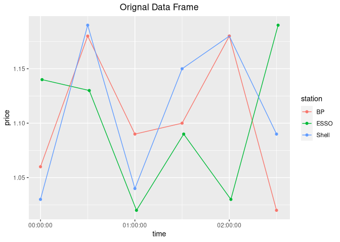
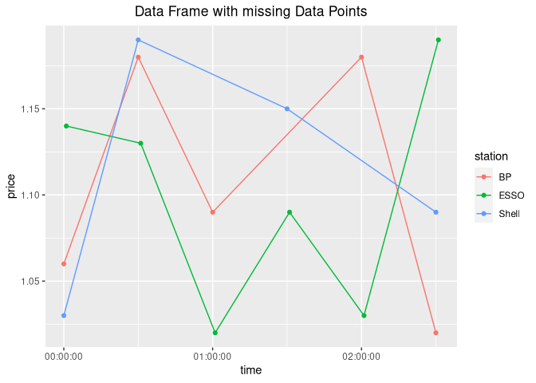
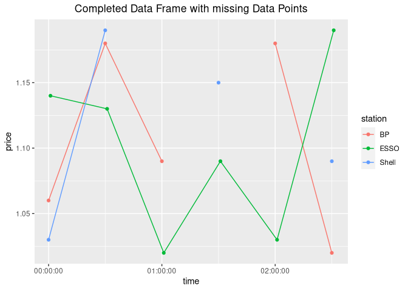

You complete me
================

``` r
if (!require("pacman")) install.packages("pacman")
```

    ## Lade nötiges Paket: pacman

``` r
library("pacman")

p_load(dplyr)
p_load(tidyr)
p_load(ggplot2)
p_load(hms)

knitr::opts_chunk$set(
  fig.path = "figures/you-complete-me/"
)
```

## 1 - Introduction

Lets say we have a data frame with prices for a specific product with
different groups and the price for a given time:

``` r
df1 <- tibble(
  product = c("Super", "Diesel", "Super", "Super", "Diesel"),
  time = c("00:00", "00:00", "01:00", "02:00", "02:00"),
  price = c(1.10, 2.10, 1.11, 1.12, 2.13)
)
df1
```

    ## # A tibble: 5 × 3
    ##   product time  price
    ##   <chr>   <chr> <dbl>
    ## 1 Super   00:00  1.1 
    ## 2 Diesel  00:00  2.1 
    ## 3 Super   01:00  1.11
    ## 4 Super   02:00  1.12
    ## 5 Diesel  02:00  2.13

*Note*: The price for Diesel at 01:00 AM was not recorded/ is missing.

The missing row for the Diesel price at 01:00 AM can be generated using
the `complete` function:

``` r
df1 %>% complete(product, time)
```

    ## # A tibble: 6 × 3
    ##   product time  price
    ##   <chr>   <chr> <dbl>
    ## 1 Diesel  00:00  2.1 
    ## 2 Diesel  01:00 NA   
    ## 3 Diesel  02:00  2.13
    ## 4 Super   00:00  1.1 
    ## 5 Super   01:00  1.11
    ## 6 Super   02:00  1.12

## 2 - Grouping

Let’s assume the gas prices are associated with a unique gas station
which is in a unique area. Area 1 always records the prices at the
00-minute mark of each hour of the day and area 2 always records the
prices at the 01-minute mark of each of of the day.

``` r
df2 <- tibble(
  area = c(1, 1, 2, 1, 2, 1, 1, 2),
  gas_station = c("A", "B", "C", "A", "C", "A", "B", "C"),
  time = c("00:00", "00:00", "00:01", "01:00", "01:01", "02:00", "02:00", "02:01"),
  price = c(1.10, 1.10, 1.05, 1.11, 1.04, 1.12, 1.12, 1.07)
)
df2
```

    ## # A tibble: 8 × 4
    ##    area gas_station time  price
    ##   <dbl> <chr>       <chr> <dbl>
    ## 1     1 A           00:00  1.1 
    ## 2     1 B           00:00  1.1 
    ## 3     2 C           00:01  1.05
    ## 4     1 A           01:00  1.11
    ## 5     2 C           01:01  1.04
    ## 6     1 A           02:00  1.12
    ## 7     1 B           02:00  1.12
    ## 8     2 C           02:01  1.07

*Note*: The price for gas_station B at 01:00 AM was not recorded/ is
missing.

A simple `complete` would create an undesired result, because undesired
rows would be generated. Since prices in area A are never recorded at
the 01-minute mark, these rows are redundant:

``` r
df2 %>% complete(area, gas_station, time)
```

    ## # A tibble: 36 × 4
    ##     area gas_station time  price
    ##    <dbl> <chr>       <chr> <dbl>
    ##  1     1 A           00:00  1.1 
    ##  2     1 A           00:01 NA   
    ##  3     1 A           01:00  1.11
    ##  4     1 A           01:01 NA   
    ##  5     1 A           02:00  1.12
    ##  6     1 A           02:01 NA   
    ##  7     1 B           00:00  1.1 
    ##  8     1 B           00:01 NA   
    ##  9     1 B           01:00 NA   
    ## 10     1 B           01:01 NA   
    ## # … with 26 more rows

To complete this date frame correctly, the price records have to be
grouped by area.

``` r
df2 %>% 
  group_by(area) %>% 
  complete(gas_station, time)
```

    ## # A tibble: 9 × 4
    ## # Groups:   area [2]
    ##    area gas_station time  price
    ##   <dbl> <chr>       <chr> <dbl>
    ## 1     1 A           00:00  1.1 
    ## 2     1 A           01:00  1.11
    ## 3     1 A           02:00  1.12
    ## 4     1 B           00:00  1.1 
    ## 5     1 B           01:00 NA   
    ## 6     1 B           02:00  1.12
    ## 7     2 C           00:01  1.05
    ## 8     2 C           01:01  1.04
    ## 9     2 C           02:01  1.07

## 3 - Complex Grouping

Let’s assume that each gas_station in each area records both the prices
for Super and Diesel. The prices for each product of each area are
reported at the same time.

``` r
stations <- c("A", "B", "C")
products <- c("Super", "Diesel")
num_stations <- 3
num_products <- 2
num_records <- 3

set.seed(197)

df3 <- tibble(
  time = c(
    "00:00", "00:00", "00:01", "00:30", "00:30", "00:31", 
    "01:00", "01:00", "01:01", "01:30", "01:30", "01:31", 
    "02:00", "02:00", "02:01", "02:30", "02:30", "02:31"
    ), 
  area = rep(c(1, 1, 2), times = num_records * num_products),
  gas_station = rep(stations, times = num_products * num_records),
  product = rep(rep(products, each=num_stations), times = num_records),
  price = round(runif(n= num_records * num_products * num_stations, min=1, max=1.2), 2)
)
df3
```

    ## # A tibble: 18 × 5
    ##    time   area gas_station product price
    ##    <chr> <dbl> <chr>       <chr>   <dbl>
    ##  1 00:00     1 A           Super    1.15
    ##  2 00:00     1 B           Super    1.09
    ##  3 00:01     2 C           Super    1.02
    ##  4 00:30     1 A           Diesel   1.01
    ##  5 00:30     1 B           Diesel   1.2 
    ##  6 00:31     2 C           Diesel   1.12
    ##  7 01:00     1 A           Super    1.15
    ##  8 01:00     1 B           Super    1.07
    ##  9 01:01     2 C           Super    1.15
    ## 10 01:30     1 A           Diesel   1.11
    ## 11 01:30     1 B           Diesel   1.15
    ## 12 01:31     2 C           Diesel   1.08
    ## 13 02:00     1 A           Super    1.06
    ## 14 02:00     1 B           Super    1.08
    ## 15 02:01     2 C           Super    1.14
    ## 16 02:30     1 A           Diesel   1.19
    ## 17 02:30     1 B           Diesel   1.06
    ## 18 02:31     2 C           Diesel   1.04

For whatever reason, some records have been lost:

``` r
df3_missing <- df3 %>% 
  filter(!(time == "01:30" & gas_station == "B" & product == "Diesel")) %>%
  filter(!(time == "02:00" & gas_station == "A" & product == "Super")) %>%
  filter(!(time == "01:00" & gas_station == "A" & product == "Super"))
df3_missing
```

    ## # A tibble: 15 × 5
    ##    time   area gas_station product price
    ##    <chr> <dbl> <chr>       <chr>   <dbl>
    ##  1 00:00     1 A           Super    1.15
    ##  2 00:00     1 B           Super    1.09
    ##  3 00:01     2 C           Super    1.02
    ##  4 00:30     1 A           Diesel   1.01
    ##  5 00:30     1 B           Diesel   1.2 
    ##  6 00:31     2 C           Diesel   1.12
    ##  7 01:00     1 B           Super    1.07
    ##  8 01:01     2 C           Super    1.15
    ##  9 01:30     1 A           Diesel   1.11
    ## 10 01:31     2 C           Diesel   1.08
    ## 11 02:00     1 B           Super    1.08
    ## 12 02:01     2 C           Super    1.14
    ## 13 02:30     1 A           Diesel   1.19
    ## 14 02:30     1 B           Diesel   1.06
    ## 15 02:31     2 C           Diesel   1.04

Now, to indicate the missing records, the missing rows can be generated
using complete:

``` r
df3_complete <- df3_missing %>% 
  group_by(area, product) %>% 
  complete(gas_station, time)
```

Now the tibble can be reordered again:

``` r
df3_complete <- df3_complete %>% 
  relocate(time, area, gas_station, product) %>% 
  arrange(time, gas_station)
df3_complete
```

    ## # A tibble: 18 × 5
    ## # Groups:   area, product [4]
    ##    time   area gas_station product price
    ##    <chr> <dbl> <chr>       <chr>   <dbl>
    ##  1 00:00     1 A           Super    1.15
    ##  2 00:00     1 B           Super    1.09
    ##  3 00:01     2 C           Super    1.02
    ##  4 00:30     1 A           Diesel   1.01
    ##  5 00:30     1 B           Diesel   1.2 
    ##  6 00:31     2 C           Diesel   1.12
    ##  7 01:00     1 A           Super   NA   
    ##  8 01:00     1 B           Super    1.07
    ##  9 01:01     2 C           Super    1.15
    ## 10 01:30     1 A           Diesel   1.11
    ## 11 01:30     1 B           Diesel  NA   
    ## 12 01:31     2 C           Diesel   1.08
    ## 13 02:00     1 A           Super   NA   
    ## 14 02:00     1 B           Super    1.08
    ## 15 02:01     2 C           Super    1.14
    ## 16 02:30     1 A           Diesel   1.19
    ## 17 02:30     1 B           Diesel   1.06
    ## 18 02:31     2 C           Diesel   1.04

## 4 - Coupled columns

Let’s say there are certain columns in the data frame that a coupled
with each other - product_name and product_id - area_name and area_id -
station_name and station_id

``` r
station_ids <- c(1, 2, 3)
station_names <- c("Shell", "BP", "ESSO")
area_ids <- c(1, 2)
area_names <- c("Berlin", "Frankfurt")
product_ids <- c(1, 2)
product_names <- c("Super", "Diesel")

num_stations <- length(station_ids)
num_products <- length(product_ids)
num_records <- 3

set.seed(345678)

df4 <- tibble(
  time = c(
    "00:00", "00:00", "00:01", "00:30", "00:30", "00:31", 
    "01:00", "01:00", "01:01", "01:30", "01:30", "01:31", 
    "02:00", "02:00", "02:01", "02:30", "02:30", "02:31"
    ), 
  area_id = rep(c(1, 1, 2), times = num_records * num_products),
  area = rep(c("Berlin", "Berlin", "Frankfurt"), times = num_records * num_products),
  
  station_id = rep(station_ids, times = num_products * num_records),
  station = rep(station_names, times = num_products * num_records),
  
  product_id = rep(rep(product_ids, each=num_stations), times = num_records),
  product = rep(rep(product_names, each=num_stations), times = num_records),
  
  price = round(runif(n= num_records * num_products * num_stations, min=1, max=1.2), 2)
)
df4
```

    ## # A tibble: 18 × 8
    ##    time  area_id area      station_id station product_id product price
    ##    <chr>   <dbl> <chr>          <dbl> <chr>        <dbl> <chr>   <dbl>
    ##  1 00:00       1 Berlin             1 Shell            1 Super    1.03
    ##  2 00:00       1 Berlin             2 BP               1 Super    1.06
    ##  3 00:01       2 Frankfurt          3 ESSO             1 Super    1.14
    ##  4 00:30       1 Berlin             1 Shell            2 Diesel   1.19
    ##  5 00:30       1 Berlin             2 BP               2 Diesel   1.18
    ##  6 00:31       2 Frankfurt          3 ESSO             2 Diesel   1.13
    ##  7 01:00       1 Berlin             1 Shell            1 Super    1.04
    ##  8 01:00       1 Berlin             2 BP               1 Super    1.09
    ##  9 01:01       2 Frankfurt          3 ESSO             1 Super    1.02
    ## 10 01:30       1 Berlin             1 Shell            2 Diesel   1.15
    ## 11 01:30       1 Berlin             2 BP               2 Diesel   1.1 
    ## 12 01:31       2 Frankfurt          3 ESSO             2 Diesel   1.09
    ## 13 02:00       1 Berlin             1 Shell            1 Super    1.18
    ## 14 02:00       1 Berlin             2 BP               1 Super    1.18
    ## 15 02:01       2 Frankfurt          3 ESSO             1 Super    1.03
    ## 16 02:30       1 Berlin             1 Shell            2 Diesel   1.09
    ## 17 02:30       1 Berlin             2 BP               2 Diesel   1.02
    ## 18 02:31       2 Frankfurt          3 ESSO             2 Diesel   1.19

And some records have been lost again:

``` r
df4_missing <- df4 %>% 
  filter(!(time == "01:00" & station == "Shell" & product == "Super")) %>%
  filter(!(time == "01:30" & station == "BP" & product == "Diesel")) %>%
  filter(!(time == "02:00" & station == "Shell" & product == "Super"))
  
df4_missing
```

    ## # A tibble: 15 × 8
    ##    time  area_id area      station_id station product_id product price
    ##    <chr>   <dbl> <chr>          <dbl> <chr>        <dbl> <chr>   <dbl>
    ##  1 00:00       1 Berlin             1 Shell            1 Super    1.03
    ##  2 00:00       1 Berlin             2 BP               1 Super    1.06
    ##  3 00:01       2 Frankfurt          3 ESSO             1 Super    1.14
    ##  4 00:30       1 Berlin             1 Shell            2 Diesel   1.19
    ##  5 00:30       1 Berlin             2 BP               2 Diesel   1.18
    ##  6 00:31       2 Frankfurt          3 ESSO             2 Diesel   1.13
    ##  7 01:00       1 Berlin             2 BP               1 Super    1.09
    ##  8 01:01       2 Frankfurt          3 ESSO             1 Super    1.02
    ##  9 01:30       1 Berlin             1 Shell            2 Diesel   1.15
    ## 10 01:31       2 Frankfurt          3 ESSO             2 Diesel   1.09
    ## 11 02:00       1 Berlin             2 BP               1 Super    1.18
    ## 12 02:01       2 Frankfurt          3 ESSO             1 Super    1.03
    ## 13 02:30       1 Berlin             1 Shell            2 Diesel   1.09
    ## 14 02:30       1 Berlin             2 BP               2 Diesel   1.02
    ## 15 02:31       2 Frankfurt          3 ESSO             2 Diesel   1.19

A simple complete would generate too many rows:

``` r
df4_missing %>% 
  group_by(area, product) %>% 
  complete(station, station_id, area_id, product_id, time)
```

    ## # A tibble: 30 × 8
    ## # Groups:   area, product [4]
    ##    area   product station station_id area_id product_id time  price
    ##    <chr>  <chr>   <chr>        <dbl>   <dbl>      <dbl> <chr> <dbl>
    ##  1 Berlin Diesel  BP               1       1          2 00:30 NA   
    ##  2 Berlin Diesel  BP               1       1          2 01:30 NA   
    ##  3 Berlin Diesel  BP               1       1          2 02:30 NA   
    ##  4 Berlin Diesel  BP               2       1          2 00:30  1.18
    ##  5 Berlin Diesel  BP               2       1          2 01:30 NA   
    ##  6 Berlin Diesel  BP               2       1          2 02:30  1.02
    ##  7 Berlin Diesel  Shell            1       1          2 00:30  1.19
    ##  8 Berlin Diesel  Shell            1       1          2 01:30  1.15
    ##  9 Berlin Diesel  Shell            1       1          2 02:30  1.09
    ## 10 Berlin Diesel  Shell            2       1          2 00:30 NA   
    ## # … with 20 more rows

To find only the combinations (of station, station_id, area_id and
product_id) that occur in the group data, `nesting` should be used:

``` r
df4_complete <- df4_missing %>% 
  group_by(area, product) %>% 
  complete(nesting(station, station_id, area_id, product_id), time)

df4_complete
```

    ## # A tibble: 18 × 8
    ## # Groups:   area, product [4]
    ##    area      product station station_id area_id product_id time  price
    ##    <chr>     <chr>   <chr>        <dbl>   <dbl>      <dbl> <chr> <dbl>
    ##  1 Berlin    Diesel  BP               2       1          2 00:30  1.18
    ##  2 Berlin    Diesel  BP               2       1          2 01:30 NA   
    ##  3 Berlin    Diesel  BP               2       1          2 02:30  1.02
    ##  4 Berlin    Diesel  Shell            1       1          2 00:30  1.19
    ##  5 Berlin    Diesel  Shell            1       1          2 01:30  1.15
    ##  6 Berlin    Diesel  Shell            1       1          2 02:30  1.09
    ##  7 Berlin    Super   BP               2       1          1 00:00  1.06
    ##  8 Berlin    Super   BP               2       1          1 01:00  1.09
    ##  9 Berlin    Super   BP               2       1          1 02:00  1.18
    ## 10 Berlin    Super   Shell            1       1          1 00:00  1.03
    ## 11 Berlin    Super   Shell            1       1          1 01:00 NA   
    ## 12 Berlin    Super   Shell            1       1          1 02:00 NA   
    ## 13 Frankfurt Diesel  ESSO             3       2          2 00:31  1.13
    ## 14 Frankfurt Diesel  ESSO             3       2          2 01:31  1.09
    ## 15 Frankfurt Diesel  ESSO             3       2          2 02:31  1.19
    ## 16 Frankfurt Super   ESSO             3       2          1 00:01  1.14
    ## 17 Frankfurt Super   ESSO             3       2          1 01:01  1.02
    ## 18 Frankfurt Super   ESSO             3       2          1 02:01  1.03

Now the tibble can be reordered again:

``` r
df4_complete <- df4_complete %>% 
  relocate(time, area_id, area, station_id, station, product_id, product) %>% 
  arrange(time, station_id)

df4_complete
```

    ## # A tibble: 18 × 8
    ## # Groups:   area, product [4]
    ##    time  area_id area      station_id station product_id product price
    ##    <chr>   <dbl> <chr>          <dbl> <chr>        <dbl> <chr>   <dbl>
    ##  1 00:00       1 Berlin             1 Shell            1 Super    1.03
    ##  2 00:00       1 Berlin             2 BP               1 Super    1.06
    ##  3 00:01       2 Frankfurt          3 ESSO             1 Super    1.14
    ##  4 00:30       1 Berlin             1 Shell            2 Diesel   1.19
    ##  5 00:30       1 Berlin             2 BP               2 Diesel   1.18
    ##  6 00:31       2 Frankfurt          3 ESSO             2 Diesel   1.13
    ##  7 01:00       1 Berlin             1 Shell            1 Super   NA   
    ##  8 01:00       1 Berlin             2 BP               1 Super    1.09
    ##  9 01:01       2 Frankfurt          3 ESSO             1 Super    1.02
    ## 10 01:30       1 Berlin             1 Shell            2 Diesel   1.15
    ## 11 01:30       1 Berlin             2 BP               2 Diesel  NA   
    ## 12 01:31       2 Frankfurt          3 ESSO             2 Diesel   1.09
    ## 13 02:00       1 Berlin             1 Shell            1 Super   NA   
    ## 14 02:00       1 Berlin             2 BP               1 Super    1.18
    ## 15 02:01       2 Frankfurt          3 ESSO             1 Super    1.03
    ## 16 02:30       1 Berlin             1 Shell            2 Diesel   1.09
    ## 17 02:30       1 Berlin             2 BP               2 Diesel   1.02
    ## 18 02:31       2 Frankfurt          3 ESSO             2 Diesel   1.19

### Plot comparison

``` r
ggplot(df4, aes(parse_hm(time), price, color=station)) + 
  geom_point() +
  geom_line() + 
  xlab("time") +
  ggtitle("Orignal Data Frame") +
  theme(plot.title = element_text(hjust = 0.5))
```

<!-- -->

``` r
ggplot(df4_missing, aes(parse_hm(time), price, color=station)) + 
  geom_point() +
  geom_line() + 
  xlab("time") +
  ggtitle("Data Frame with missing Data Points") +
  theme(plot.title = element_text(hjust = 0.5))
```

<!-- -->

``` r
ggplot(df4_complete, aes(parse_hm(time), price, color=station)) + 
  geom_point() +
  geom_line() + 
  xlab("time") +
  ggtitle("Completed Data Frame with missing Data Points") +
  theme(plot.title = element_text(hjust = 0.5))
```

    ## Warning: Removed 3 rows containing missing values (geom_point).

<!-- -->

## References

-   <https://tidyr.tidyverse.org/reference/complete.html>
-   <https://web.archive.org/web/20200312082724/http://www.imachordata.com/you-complete-me/>

### Misc

-   <https://stackoverflow.com/questions/39814916/how-can-i-see-output-of-rmd-in-github/39816334>
-   <http://uc-r.github.io/setting_seed/>
